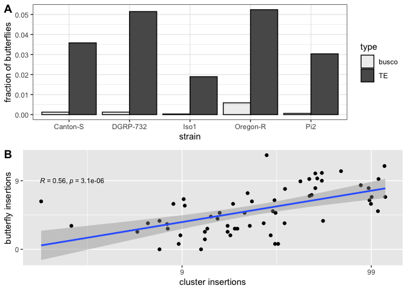

Butterflies
================
Filip Wierzbicki
7/4/2022

This script correlates abundance of stand-alone source loci
(butterflies) with TE abundance in clusters.

``` bash
#prefiltering:
cd /Volumes/Temp3/filip/trap_model/proTRAC/trimming/trimmed/sf/map
for i in *.sam; do n=${i%.sam}; cat $i|grep -v '^@'|awk '$3 !~ /_miRNA|_rRNA|_snRNA|_snoRNA|_tRNA/'|awk '{if ((22<length($10)) && (length($10)<30)) print $0}'|awk '{print "@" $1; print $10; print "+" $1; print $11}' > /Volumes/Temp3/filip/trap_model/butterfly/filtered-reads/${n}.fastq; done
#mapping to genome
for i in *fastq;do n=${i%.fastq};novoalign -d /Volumes/Temp3/filip/trap_model/whole-genome/assemblies/${n}.nvi -f $i -F STDFQ -o SAM -o FullNW -r RANDOM > map/${n}.sam;done
#screening for butterflies
nohup sh -c 'for i in *sam;do n=${i%.sam};python /Volumes/Temp3/filip/trap_model/trapmodel/helper-scripts/butterfly_finder-V2.py --sam $i --rm /Volumes/Temp3/filip/trap_model/whole-genome/repeatmasker/${n}.fasta.out --window 500 --minlen 100 --maxdiv 10.0 --min-mq 5 --id ${n} > other-parameter/TE/${n}_w500.txt;done' &
```

``` r
library(dplyr)
```

    ## 
    ## Attaching package: 'dplyr'

    ## The following objects are masked from 'package:stats':
    ## 
    ##     filter, lag

    ## The following objects are masked from 'package:base':
    ## 
    ##     intersect, setdiff, setequal, union

``` r
library(ggplot2)
library(ggpubr)

th=15
#th=30

b1<-read.table("/Volumes/Temp3/filip/trap_model/butterfly/filtered-reads/map/other-parameter/TE/Canton-S_w500.txt")
#b1<-read.table("/Volumes/Temp3/filip/trap_model/butterfly/filtered-reads/map/output-V2/Canton-S.txt")
names(b1)<-c("TE","chr","start","end","ls","la","rs","ra","strain")
b2<-read.table("/Volumes/Temp3/filip/trap_model/butterfly/filtered-reads/map/other-parameter/TE/DGRP-732_w500.txt")
#b2<-read.table("/Volumes/Temp3/filip/trap_model/butterfly/filtered-reads/map/output-V2/DGRP-732.txt")
names(b2)<-c("TE","chr","start","end","ls","la","rs","ra","strain")
b3<-read.table("/Volumes/Temp3/filip/trap_model/butterfly/filtered-reads/map/other-parameter/TE/Iso1_w500.txt")
#b3<-read.table("/Volumes/Temp3/filip/trap_model/butterfly/filtered-reads/map/output-V2/Iso1.txt")
names(b3)<-c("TE","chr","start","end","ls","la","rs","ra","strain")
b4<-read.table("/Volumes/Temp3/filip/trap_model/butterfly/filtered-reads/map/other-parameter/TE/Oregon-R_w500.txt")
#b4<-read.table("/Volumes/Temp3/filip/trap_model/butterfly/filtered-reads/map/output-V2/Oregon-R.txt")
names(b4)<-c("TE","chr","start","end","ls","la","rs","ra","strain")
b5<-read.table("/Volumes/Temp3/filip/trap_model/butterfly/filtered-reads/map/other-parameter/TE/Pi2_w500.txt")
#b5<-read.table("/Volumes/Temp3/filip/trap_model/butterfly/filtered-reads/map/output-V2/Pi2.txt")
names(b5)<-c("TE","chr","start","end","ls","la","rs","ra","strain")


a1<-read.table("/Users/filipwierzbicki/Desktop/trap_model/analysis/abu/cusco_tas/gapped_combined-distinct/Canton-S_gapped_cusco_tas_summary.forR")
a2<-read.table("/Users/filipwierzbicki/Desktop/trap_model/analysis/abu/cusco_tas/gapped_combined-distinct/DGRP-732_gapped_cusco_tas_summary.forR")
a3<-read.table("/Users/filipwierzbicki/Desktop/trap_model/analysis/abu/cusco_tas/gapped_combined-distinct/Iso1_gapped_cusco_tas_summary.forR")
a4<-read.table("/Users/filipwierzbicki/Desktop/trap_model/analysis/abu/cusco_tas/gapped_combined-distinct/Oregon-R_gapped_cusco_tas_summary.forR")
a5<-read.table("/Users/filipwierzbicki/Desktop/trap_model/analysis/abu/cusco_tas/gapped_combined-distinct/Pi2_gapped_cusco_tas_summary.forR")
names(a1)<-c("count","strain","TE","region")
names(a2)<-c("count","strain","TE","region")
names(a3)<-c("count","strain","TE","region")
names(a4)<-c("count","strain","TE","region")
names(a5)<-c("count","strain","TE","region")

c1<-read.table("/Users/filipwierzbicki/Desktop/trap_model/analysis/abu/cusco_tas/gapped_combined-distinct/Canton-S_cluster.bed")
names(c1)<-c("chr","start","end","cluster","ig","ir")
c2<-read.table("/Users/filipwierzbicki/Desktop/trap_model/analysis/abu/cusco_tas/gapped_combined-distinct/DGRP-732_cluster.bed")
names(c2)<-c("chr","start","end","cluster","ig","ir")
c3<-read.table("/Users/filipwierzbicki/Desktop/trap_model/analysis/abu/cusco_tas/gapped_combined-distinct/Iso1_cluster.bed")
names(c3)<-c("chr","start","end","cluster","ig","ir")
c4<-read.table("/Users/filipwierzbicki/Desktop/trap_model/analysis/abu/cusco_tas/gapped_combined-distinct/Oregon-R_cluster.bed")
names(c4)<-c("chr","start","end","cluster","ig","ir")
c5<-read.table("/Users/filipwierzbicki/Desktop/trap_model/analysis/abu/cusco_tas/gapped_combined-distinct/Pi2_cluster.bed")
names(c5)<-c("chr","start","end","cluster","ig","ir")

c1$start<-c1$start+1
c1$end<-c1$end+1

c2$start<-c2$start+1
c2$end<-c2$end+1

c3$start<-c3$start+1
c3$end<-c3$end+1

c4$start<-c4$start+1
c4$end<-c4$end+1

c5$start<-c5$start+1
c5$end<-c5$end+1


b1$id<-paste(b1$TE,b1$chr,b1$start,b1$end,sep = "_")
b2$id<-paste(b2$TE,b2$chr,b2$start,b2$end,sep = "_")
b3$id<-paste(b3$TE,b3$chr,b3$start,b3$end,sep = "_")
b4$id<-paste(b4$TE,b4$chr,b4$start,b4$end,sep = "_")
b5$id<-paste(b5$TE,b5$chr,b5$start,b5$end,sep = "_")

###
#excluding signatures from clusters: 
ic=b1[FALSE,]

for(i in 1:nrow(b1)) {
  row <- b1[i,]

  for(k in 1:nrow(c1)){
    line <- c1[k,]
    if ((line$chr==row$chr && line$start<=row$start&&row$start<=line$end)||(line$chr==row$chr && line$start<=row$end&&row$end<=line$end)){
      ic[nrow(ic) + 1,] <- row
      break
    }
    
  }
}

nc<-anti_join(b1,ic,by="id")

ic=nc[FALSE,]

for(i in 1:nrow(nc)) {
  row <- nc[i,]
  if (row$la>=th && row$rs>=th){
    ic[nrow(ic) + 1,] <- row
  }
}


for (sid in unique(ic$TE)) { 
  i <- ic$TE == sid
  x = nrow(subset(ic,ic$TE==sid))
  ic$butterfly[i] = x
}
bfs<-subset(ic,select = c("TE","butterfly","strain"))
bfs<-unique(bfs)
ac<-subset(a1,region=="cluster")
ac<-subset(ac,select=c("TE","count"))
TE1<-full_join(bfs,ac,by="TE")

#

ic=b2[FALSE,]

for(i in 1:nrow(b2)) {
  row <- b2[i,]
  
  for(k in 1:nrow(c2)){
    line <- c2[k,]
    if ((line$chr==row$chr && line$start<=row$start&&row$start<=line$end)||(line$chr==row$chr && line$start<=row$end&&row$end<=line$end)){
      ic[nrow(ic) + 1,] <- row
      break
    }
    
  }
}

nc<-anti_join(b2,ic,by="id")

ic=nc[FALSE,]

for(i in 1:nrow(nc)) {
  row <- nc[i,]
  if (row$la>=th && row$rs>=th){
    ic[nrow(ic) + 1,] <- row
  }
}

for (sid in unique(ic$TE)) { 
  i <- ic$TE == sid
  x = nrow(subset(ic,ic$TE==sid))
  ic$butterfly[i] = x
}
bfs<-subset(ic,select = c("TE","butterfly","strain"))
bfs<-unique(bfs)
ac<-subset(a2,region=="cluster")
ac<-subset(ac,select=c("TE","count"))
TE2<-full_join(bfs,ac,by="TE")

#

ic=b3[FALSE,]

for(i in 1:nrow(b3)) {
  row <- b3[i,]
  
  for(k in 1:nrow(c3)){
    line <- c3[k,]
    if ((line$chr==row$chr && line$start<=row$start&&row$start<=line$end)||(line$chr==row$chr && line$start<=row$end&&row$end<=line$end)){
      ic[nrow(ic) + 1,] <- row
      break
    }
    
  }
}

nc<-anti_join(b3,ic,by="id")

ic=nc[FALSE,]

for(i in 1:nrow(nc)) {
  row <- nc[i,]
  if (row$la>=th && row$rs>=th){
    ic[nrow(ic) + 1,] <- row
  }
}

for (sid in unique(ic$TE)) { 
  i <- ic$TE == sid
  x = nrow(subset(ic,ic$TE==sid))
  ic$butterfly[i] = x
}
bfs<-subset(ic,select = c("TE","butterfly","strain"))
bfs<-unique(bfs)
ac<-subset(a3,region=="cluster")
ac<-subset(ac,select=c("TE","count"))
TE3<-full_join(bfs,ac,by="TE")

#

ic=b4[FALSE,]

for(i in 1:nrow(b4)) {
  row <- b4[i,]
  
  for(k in 1:nrow(c4)){
    line <- c4[k,]
    if ((line$chr==row$chr && line$start<=row$start&&row$start<=line$end)||(line$chr==row$chr && line$start<=row$end&&row$end<=line$end)){
      ic[nrow(ic) + 1,] <- row
      break
    }
    
  }
}

nc<-anti_join(b4,ic,by="id")

ic=nc[FALSE,]

for(i in 1:nrow(nc)) {
  row <- nc[i,]
  if (row$la>=th && row$rs>=th){
    ic[nrow(ic) + 1,] <- row
  }
}

for (sid in unique(ic$TE)) { 
  i <- ic$TE == sid
  x = nrow(subset(ic,ic$TE==sid))
  ic$butterfly[i] = x
}
bfs<-subset(ic,select = c("TE","butterfly","strain"))
bfs<-unique(bfs)
ac<-subset(a4,region=="cluster")
ac<-subset(ac,select=c("TE","count"))
TE4<-full_join(bfs,ac,by="TE")

#

ic=b5[FALSE,]

for(i in 1:nrow(b5)) {
  row <- b5[i,]
  
  for(k in 1:nrow(c5)){
    line <- c5[k,]
    if ((line$chr==row$chr && line$start<=row$start&&row$start<=line$end)||(line$chr==row$chr && line$start<=row$end&&row$end<=line$end)){
      ic[nrow(ic) + 1,] <- row
      break
    }
    
  }
}

nc<-anti_join(b5,ic,by="id")

ic=nc[FALSE,]

for(i in 1:nrow(nc)) {
  row <- nc[i,]
  if (row$la>=th && row$rs>=th){
    ic[nrow(ic) + 1,] <- row
  }
}

for (sid in unique(ic$TE)) { 
  i <- ic$TE == sid
  x = nrow(subset(ic,ic$TE==sid))
  ic$butterfly[i] = x
}
bfs<-subset(ic,select = c("TE","butterfly","strain"))
bfs<-unique(bfs)
ac<-subset(a5,region=="cluster")
ac<-subset(ac,select=c("TE","count"))
TE5<-full_join(bfs,ac,by="TE")


#######
###For population frequency Info based on Kofler et al. 2015 PLOS Genetics
info1<-read.table("/Users/filipwierzbicki/Desktop/evolution_cluster/temp/TEfamInfo_correct")
names(info1)<-c("name","TE","order","AF","popins")

###exclude somatically regulated TEs based on Malone et al. 2009 Cell
info1<-subset(info1,name!="gypsy10"&name!="gypsy"&name!="ZAM"&name!="gtwin"&name!="gypsy5"&name!="Tabor")

info<-subset(info1,select=c("TE","AF"))
info$AF<-round(info$AF,digits = 1)

infoP<-subset(info1,select=c("name","AF"))
infoP$AF<-round(infoP$AF,digits = 1)
names(infoP)<-c("TE","AF")


#summary that needs to be kept:
t<-rbind(TE1,TE2,TE3,TE4,TE5)

t[is.na(t)] <- 0
```

    ## Warning in `[<-.factor`(`*tmp*`, thisvar, value = 0): invalid factor level, NA
    ## generated

``` r
for (sid in unique(t$TE)) { 
  i <- t$TE == sid
  a = mean(t$count[i])
  b = mean(t$butterfly[i])
  t$avrcl[i] = a
  t$avrbut[i] = b
}

t<-subset(t,select = c("TE","avrcl","avrbut"))
t<-unique(t)

t<-left_join(t,info,by="TE")

#including AF threshold
t<-subset(t,AF!="NA")##remove missing AFs
t<-subset(t,AF<=0.2)
t$clusterlog<-log10(t$avrcl+1)
t$butterflylog<-log10(t$avrbut+1)


gcor<-ggplot(t,aes(x=clusterlog,y=butterflylog))+geom_point()+stat_cor(method = "pearson", label.x = 0.25, label.y = 1.0,size=3)+ 
  geom_smooth(method='lm', formula= y~x)+xlab("cluster insertions")+ylab("butterfly insertions")+scale_x_continuous(breaks=c(0,1,2),labels=c("0","9","99"))+scale_y_continuous(breaks=c(0,1,2),labels=c("0","9","99"))


a1r<-subset(a1,region!="cluster")

a1r$id2<-paste(a1r$strain,a1r$TE,sep="+")
for (sid in unique(a1r$id2)) { 
  i <- a1r$id2 == sid
  a = sum(a1r$count[i])
  a1r$sum[i] = a
}
a1r<-subset(a1r,select=c("sum","TE","strain"))
a1r<-unique(a1r)

t1a<-full_join(a1r,TE1,by="TE")
t1a[is.na(t1a)] <- 0
```

    ## Warning in `[<-.factor`(`*tmp*`, thisvar, value = 0): invalid factor level, NA
    ## generated
    
    ## Warning in `[<-.factor`(`*tmp*`, thisvar, value = 0): invalid factor level, NA
    ## generated

``` r
t1a<-left_join(t1a,info,by="TE")

#including AF threshold
t1a<-subset(t1a,AF!="NA")##remove missing AFs
t1a<-subset(t1a,AF<=0.2)


a2r<-subset(a2,region!="cluster")

a2r$id2<-paste(a2r$strain,a2r$TE,sep="+")
for (sid in unique(a2r$id2)) { 
  i <- a2r$id2 == sid
  a = sum(a2r$count[i])
  a2r$sum[i] = a
}
a2r<-subset(a2r,select=c("sum","TE","strain"))
a2r<-unique(a2r)

t2a<-full_join(a2r,TE2,by="TE")
t2a[is.na(t2a)] <- 0
```

    ## Warning in `[<-.factor`(`*tmp*`, thisvar, value = 0): invalid factor level, NA
    ## generated

``` r
t2a<-left_join(t2a,info,by="TE")

#including AF threshold
t2a<-subset(t2a,AF!="NA")##remove missing AFs
t2a<-subset(t2a,AF<=0.2)


a3r<-subset(a3,region!="cluster")

a3r$id2<-paste(a3r$strain,a3r$TE,sep="+")
for (sid in unique(a3r$id2)) { 
  i <- a3r$id2 == sid
  a = sum(a3r$count[i])
  a3r$sum[i] = a
}
a3r<-subset(a3r,select=c("sum","TE","strain"))
a3r<-unique(a3r)

t3a<-full_join(a3r,TE3,by="TE")
t3a[is.na(t3a)] <- 0
```

    ## Warning in `[<-.factor`(`*tmp*`, thisvar, value = 0): invalid factor level, NA
    ## generated

``` r
t3a<-left_join(t3a,info,by="TE")

#including AF threshold
t3a<-subset(t3a,AF!="NA")##remove missing AFs
t3a<-subset(t3a,AF<=0.2)


a4r<-subset(a4,region!="cluster")

a4r$id2<-paste(a4r$strain,a4r$TE,sep="+")
for (sid in unique(a4r$id2)) { 
  i <- a4r$id2 == sid
  a = sum(a4r$count[i])
  a4r$sum[i] = a
}
a4r<-subset(a4r,select=c("sum","TE","strain"))
a4r<-unique(a4r)

t4a<-full_join(a4r,TE4,by="TE")
t4a[is.na(t4a)] <- 0
```

    ## Warning in `[<-.factor`(`*tmp*`, thisvar, value = 0): invalid factor level, NA
    ## generated
    
    ## Warning in `[<-.factor`(`*tmp*`, thisvar, value = 0): invalid factor level, NA
    ## generated

``` r
t4a<-left_join(t4a,info,by="TE")

#including AF threshold
t4a<-subset(t4a,AF!="NA")##remove missing AFs
t4a<-subset(t4a,AF<=0.2)


a5r<-subset(a5,region!="cluster")

a5r$id2<-paste(a5r$strain,a5r$TE,sep="+")
for (sid in unique(a5r$id2)) { 
  i <- a5r$id2 == sid
  a = sum(a5r$count[i])
  a5r$sum[i] = a
}
a5r<-subset(a5r,select=c("sum","TE","strain"))
a5r<-unique(a5r)

t5a<-full_join(a5r,TE5,by="TE")
t5a[is.na(t5a)] <- 0
```

    ## Warning in `[<-.factor`(`*tmp*`, thisvar, value = 0): invalid factor level, NA
    ## generated
    
    ## Warning in `[<-.factor`(`*tmp*`, thisvar, value = 0): invalid factor level, NA
    ## generated

``` r
t5a<-left_join(t5a,info,by="TE")

#including AF threshold
t5a<-subset(t5a,AF!="NA")##remove missing AFs
t5a<-subset(t5a,AF<=0.2)


ta<-rbind(t1a,t2a,t3a,t4a,t5a)
ta0<-subset(ta,count==0)

hier<-read.table("/Users/filipwierzbicki/Desktop/trap_model/data/other/new_dmel_132cons_hier",header =TRUE)
hier<-subset(hier,select=c("id","family"))
names(hier)<-c("TE","family")
ta0<-left_join(ta0,hier,by="TE")
ta0<-subset(ta0,select=c("family","sum","butterfly","count","strain.x"))
names(ta0)<-c("family","non-cluster","other-SL","cluster","strain")

write.table(ta0,"/Users/filipwierzbicki/Desktop/trap_model/analysis/abu/butterfly/output/missing-clusterinsertions.txt",quote=FALSE)


####signatures at BUSCO VS TE:


# butterfly signatures busco genes:
b1<-read.table("/Volumes/Temp3/filip/trap_model/butterfly/filtered-reads/map/other-parameter/busco/Canton-S_w500.txt")
names(b1)<-c("TE","chr","start","end","ls","la","rs","ra","strain")
b2<-read.table("/Volumes/Temp3/filip/trap_model/butterfly/filtered-reads/map/other-parameter/busco/DGRP-732_w500.txt")
names(b2)<-c("TE","chr","start","end","ls","la","rs","ra","strain")
b3<-read.table("/Volumes/Temp3/filip/trap_model/butterfly/filtered-reads/map/other-parameter/busco/Iso1_w500.txt")
names(b3)<-c("TE","chr","start","end","ls","la","rs","ra","strain")
b4<-read.table("/Volumes/Temp3/filip/trap_model/butterfly/filtered-reads/map/other-parameter/busco/Oregon-R_w500.txt")
names(b4)<-c("TE","chr","start","end","ls","la","rs","ra","strain")
b5<-read.table("/Volumes/Temp3/filip/trap_model/butterfly/filtered-reads/map/other-parameter/busco/Pi2_w500.txt")
names(b5)<-c("TE","chr","start","end","ls","la","rs","ra","strain")

th=15 #

ic=b1[FALSE,]

for(i in 1:nrow(b1)) {
  row <- b1[i,]
  if (row$la>=th && row$rs>=th){
    ic[nrow(ic) + 1,] <- row
  }
}

busco1<-ic
#
ic=b2[FALSE,]

for(i in 1:nrow(b2)) {
  row <- b2[i,]
  if (row$la>=th && row$rs>=th){
    ic[nrow(ic) + 1,] <- row
  }
}

busco2<-ic
#
ic=b3[FALSE,]

for(i in 1:nrow(b3)) {
  row <- b3[i,]
  if (row$la>=th && row$rs>=th){
    ic[nrow(ic) + 1,] <- row
  }
}

busco3<-ic
#
ic=b4[FALSE,]

for(i in 1:nrow(b4)) {
  row <- b4[i,]
  if (row$la>=th && row$rs>=th){
    ic[nrow(ic) + 1,] <- row
  }
}

busco4<-ic
#
ic=b5[FALSE,]

for(i in 1:nrow(b5)) {
  row <- b5[i,]
  if (row$la>=th && row$rs>=th){
    ic[nrow(ic) + 1,] <- row
  }
}

busco5<-ic

#summary that needs to be kept:
busco<-rbind(busco1,busco2,busco3,busco4,busco5)

for (sid in unique(busco$strain)) { 
  i <- busco$strain == sid
  a = nrow(subset(busco,strain==sid))
  busco$sum[i] = a
}
buscosum<-subset(busco,select=c("strain","sum"))
buscosum<-unique(buscosum)

buscosum$type<-c("busco")

#########################TEs

#butterfly signatures:
b1<-read.table("/Volumes/Temp3/filip/trap_model/butterfly/filtered-reads/map/other-parameter/TE/Canton-S_w500.txt")
names(b1)<-c("TE","chr","start","end","ls","la","rs","ra","strain")
b2<-read.table("/Volumes/Temp3/filip/trap_model/butterfly/filtered-reads/map/other-parameter/TE/DGRP-732_w500.txt")
names(b2)<-c("TE","chr","start","end","ls","la","rs","ra","strain")
b3<-read.table("/Volumes/Temp3/filip/trap_model/butterfly/filtered-reads/map/other-parameter/TE/Iso1_w500.txt")
names(b3)<-c("TE","chr","start","end","ls","la","rs","ra","strain")
b4<-read.table("/Volumes/Temp3/filip/trap_model/butterfly/filtered-reads/map/other-parameter/TE/Oregon-R_w500.txt")
names(b4)<-c("TE","chr","start","end","ls","la","rs","ra","strain")
b5<-read.table("/Volumes/Temp3/filip/trap_model/butterfly/filtered-reads/map/other-parameter/TE/Pi2_w500.txt")
names(b5)<-c("TE","chr","start","end","ls","la","rs","ra","strain")

#cluster annotations to exclude from butterfly signatures:
c1<-read.table("/Users/filipwierzbicki/Desktop/trap_model/analysis/abu/cusco_tas/gapped_combined-distinct/Canton-S_cluster.bed")
names(c1)<-c("chr","start","end","cluster","ig","ir")
c2<-read.table("/Users/filipwierzbicki/Desktop/trap_model/analysis/abu/cusco_tas/gapped_combined-distinct/DGRP-732_cluster.bed")
names(c2)<-c("chr","start","end","cluster","ig","ir")
c3<-read.table("/Users/filipwierzbicki/Desktop/trap_model/analysis/abu/cusco_tas/gapped_combined-distinct/Iso1_cluster.bed")
names(c3)<-c("chr","start","end","cluster","ig","ir")
c4<-read.table("/Users/filipwierzbicki/Desktop/trap_model/analysis/abu/cusco_tas/gapped_combined-distinct/Oregon-R_cluster.bed")
names(c4)<-c("chr","start","end","cluster","ig","ir")
c5<-read.table("/Users/filipwierzbicki/Desktop/trap_model/analysis/abu/cusco_tas/gapped_combined-distinct/Pi2_cluster.bed")
names(c5)<-c("chr","start","end","cluster","ig","ir")

c1$start<-c1$start+1
c1$end<-c1$end+1

c2$start<-c2$start+1
c2$end<-c2$end+1

c3$start<-c3$start+1
c3$end<-c3$end+1

c4$start<-c4$start+1
c4$end<-c4$end+1

c5$start<-c5$start+1
c5$end<-c5$end+1


b1$id<-paste(b1$TE,b1$chr,b1$start,b1$end,sep = "_")
b2$id<-paste(b2$TE,b2$chr,b2$start,b2$end,sep = "_")
b3$id<-paste(b3$TE,b3$chr,b3$start,b3$end,sep = "_")
b4$id<-paste(b4$TE,b4$chr,b4$start,b4$end,sep = "_")
b5$id<-paste(b5$TE,b5$chr,b5$start,b5$end,sep = "_")
###
#excluding signatures from clusters: 
ic=b1[FALSE,]

for(i in 1:nrow(b1)) {
  row <- b1[i,]

  for(k in 1:nrow(c1)){
    line <- c1[k,]
    if ((line$chr==row$chr && line$start<=row$start&&row$start<=line$end)||(line$chr==row$chr && line$start<=row$end&&row$end<=line$end)){
      ic[nrow(ic) + 1,] <- row
      break
    }
    
  }
}

nc<-anti_join(b1,ic,by="id")

ic=nc[FALSE,]

for(i in 1:nrow(nc)) {
  row <- nc[i,]
  if (row$la>=th && row$rs>=th){
    ic[nrow(ic) + 1,] <- row
  }
}

TE1<-ic
#

ic=b2[FALSE,]

for(i in 1:nrow(b2)) {
  row <- b2[i,]
  
  for(k in 1:nrow(c2)){
    line <- c2[k,]
    if ((line$chr==row$chr && line$start<=row$start&&row$start<=line$end)||(line$chr==row$chr && line$start<=row$end&&row$end<=line$end)){
      ic[nrow(ic) + 1,] <- row
      break
    }
    
  }
}

nc<-anti_join(b2,ic,by="id")

ic=nc[FALSE,]

for(i in 1:nrow(nc)) {
  row <- nc[i,]
  if (row$la>=th && row$rs>=th){
    ic[nrow(ic) + 1,] <- row
  }
}

TE2<-ic
#

ic=b3[FALSE,]

for(i in 1:nrow(b3)) {
  row <- b3[i,]
  
  for(k in 1:nrow(c3)){
    line <- c3[k,]
    if ((line$chr==row$chr && line$start<=row$start&&row$start<=line$end)||(line$chr==row$chr && line$start<=row$end&&row$end<=line$end)){
      ic[nrow(ic) + 1,] <- row
      break
    }
    
  }
}

nc<-anti_join(b3,ic,by="id")

ic=nc[FALSE,]

for(i in 1:nrow(nc)) {
  row <- nc[i,]
  if (row$la>=th && row$rs>=th){
    ic[nrow(ic) + 1,] <- row
  }
}

TE3<-ic
#

ic=b4[FALSE,]

for(i in 1:nrow(b4)) {
  row <- b4[i,]
  
  for(k in 1:nrow(c4)){
    line <- c4[k,]
    if ((line$chr==row$chr && line$start<=row$start&&row$start<=line$end)||(line$chr==row$chr && line$start<=row$end&&row$end<=line$end)){
      ic[nrow(ic) + 1,] <- row
      break
    }
    
  }
}

nc<-anti_join(b4,ic,by="id")

ic=nc[FALSE,]

for(i in 1:nrow(nc)) {
  row <- nc[i,]
  if (row$la>=th && row$rs>=th){
    ic[nrow(ic) + 1,] <- row
  }
}

TE4<-ic
#

ic=b5[FALSE,]

for(i in 1:nrow(b5)) {
  row <- b5[i,]
  
  for(k in 1:nrow(c5)){
    line <- c5[k,]
    if ((line$chr==row$chr && line$start<=row$start&&row$start<=line$end)||(line$chr==row$chr && line$start<=row$end&&row$end<=line$end)){
      ic[nrow(ic) + 1,] <- row
      break
    }
    
  }
}

nc<-anti_join(b5,ic,by="id")

ic=nc[FALSE,]

for(i in 1:nrow(nc)) {
  row <- nc[i,]
  if (row$la>=th && row$rs>=th){
    ic[nrow(ic) + 1,] <- row
  }
}

TE5<-ic
#summary that needs to be kept:
TE<-rbind(TE1,TE2,TE3,TE4,TE5)

for (sid in unique(TE$strain)) { 
  i <- TE$strain == sid
  a = nrow(subset(TE,strain==sid))
  TE$sum[i] = a
}
TEsum<-subset(TE,select=c("strain","sum"))
TEsum<-unique(TEsum)

TEsum$type<-c("TE")


bT<-rbind(buscosum,TEsum)
bT$id<-paste(bT$strain,bT$type,sep = "_")

###for butterfly signatures relative to all genes/TEs:

#busco:

b1<-read.table("/Volumes/Temp3/filip/trap_model/clusterscore/busco_bed/Canton-S_busco.bed")
b1$strain<-c("Canton-S")
b2<-read.table("/Volumes/Temp3/filip/trap_model/clusterscore/busco_bed/DGRP-732_busco.bed")
b2$strain<-c("DGRP-732")
b3<-read.table("/Volumes/Temp3/filip/trap_model/clusterscore/busco_bed/Iso1_busco.bed")
b3$strain<-c("Iso1")
b4<-read.table("/Volumes/Temp3/filip/trap_model/clusterscore/busco_bed/Oregon-R_busco.bed")
b4$strain<-c("Oregon-R")
b5<-read.table("/Volumes/Temp3/filip/trap_model/clusterscore/busco_bed/Pi2_busco.bed")
b5$strain<-c("Pi2")

b<-rbind(b1,b2,b3,b4,b5)

for (sid in unique(b$strain)) { 
  i <- b$strain == sid
  a = nrow(subset(b,strain==sid))
  b$sum[i] = a
}
abuscosum<-subset(b,select=c("strain","sum"))
abuscosum<-unique(abuscosum)

abuscosum$type<-c("busco")
abuscosum$id<-paste(abuscosum$strain,abuscosum$type,sep = "_")

#TE:
b1<-read.table("/Volumes/Temp3/filip/trap_model/whole-genome/repeatmasker/Canton-S.fasta.out",fill=TRUE)
b1$strain<-c("Canton-S")
b1<-subset(b1, select = -c(V16))
b2<-read.table("/Volumes/Temp3/filip/trap_model/whole-genome/repeatmasker/DGRP-732.fasta.out",fill=TRUE)
b2$strain<-c("DGRP-732")
#b2<-subset(b2, select = -c(V16))
b3<-read.table("/Volumes/Temp3/filip/trap_model/whole-genome/repeatmasker/Iso1.fasta.out",fill=TRUE)
b3$strain<-c("Iso1")
#b3<-subset(b3, select = -c(V16))
b4<-read.table("/Volumes/Temp3/filip/trap_model/whole-genome/repeatmasker/Oregon-R.fasta.out",fill=TRUE)
b4$strain<-c("Oregon-R")
b4<-subset(b4, select = -c(V16))
b5<-read.table("/Volumes/Temp3/filip/trap_model/whole-genome/repeatmasker/Pi2.fasta.out",fill=TRUE)
b5$strain<-c("Pi2")
b5<-subset(b5, select = -c(V16))
b<-rbind(b1,b2,b3,b4,b5)
b$div<-as.numeric(as.character(b$V2))
```

    ## Warning: NAs introduced by coercion

``` r
b<-subset(b,div<=10.0)
b$start<-as.numeric(as.character(b$V6))
b$end<-as.numeric(as.character(b$V7))
b$len<-b$end-b$start+1
b<-subset(b,len>=100)


for (sid in unique(b$strain)) { 
  i <- b$strain == sid
  a = nrow(subset(b,strain==sid))
  b$sum[i] = a
}
aTEsum<-subset(b,select=c("strain","sum"))
aTEsum<-unique(aTEsum)

aTEsum$type<-c("TE")
aTEsum$id<-paste(aTEsum$strain,aTEsum$type,sep = "_")


abT<-rbind(abuscosum,aTEsum)

frac<-inner_join(bT,abT,by="id")
frac$rel<-frac$sum.x/frac$sum.y

frac<-subset(frac,select=c("strain.x","type.x","rel"))
names(frac)<-c("strain","type","rel")

gbt<-ggplot(frac,aes(x=strain,y=rel,alpha=type))+geom_bar(stat="identity",position="dodge",color="black") +ylab("fraction of butterflies")+xlab("strain")+theme_bw()#+theme(legend.position='none')

g<-ggarrange(gbt, gcor,
                labels = c("A", "B"),
                ncol = 1, nrow = 2)
```

    ## Warning: Using alpha for a discrete variable is not advised.

``` r
plot(g)
```

<!-- -->

``` r
ggsave("/Users/filipwierzbicki/Desktop/trap_model/analysis/abu/figures/butterfly_main.pdf",width=7,height=6)
ggsave("/Users/filipwierzbicki/Desktop/trap_model/analysis/abu/figures/butterfly_main.png",width=7,height=6)
```
