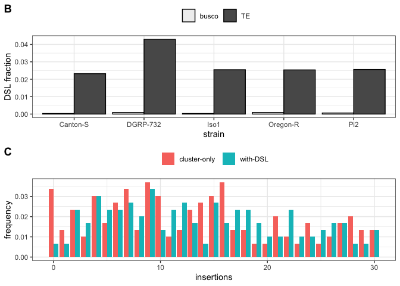

Butterflies
================
Filip Wierzbicki
10/11/2022

This script makes the basis of the main butterfly figure. It visualizes
how butterflies (non-cluster source loci) compensate missing piRNA
cluster insertions. Furthermore, it compares the abundance of butterfly
signatures at TEs and BUSCOs.

``` bash
#prefiltering:
cd /Volumes/Temp3/filip/trap_model/proTRAC/trimming/trimmed/sf/map
for i in *.sam; do n=${i%.sam}; cat $i|grep -v '^@'|awk '$3 !~ /_miRNA|_rRNA|_snRNA|_snoRNA|_tRNA/'|awk '{if ((22<length($10)) && (length($10)<30)) print $0}'|awk '{print "@" $1; print $10; print "+" $1; print $11}' > /Volumes/Temp3/filip/trap_model/butterfly/filtered-reads/${n}.fastq; done
#mapping to genome
for i in *fastq;do n=${i%.fastq};novoalign -d /Volumes/Temp3/filip/trap_model/whole-genome/assemblies/${n}.nvi -f $i -F STDFQ -o SAM -o FullNW -r RANDOM > map/${n}.sam;done
#screening for butterflies
#at TEs:
nohup sh -c 'for i in *sam;do n=${i%.sam};python /Volumes/Temp3/filip/trap_model/trapmodel/helper-scripts/butterfly_finder-V2.py --sam $i --rm /Volumes/Temp3/filip/trap_model/whole-genome/repeatmasker/${n}.fasta.out --window 500 --minlen 100 --maxdiv 10.0 --min-mq 5 --id ${n} > output-V3/TE/${n}_w500.txt;done' &
#at BUSCOs:
nohup sh -c 'for i in *sam;do n=${i%.sam};python /Volumes/Temp3/filip/trap_model/trapmodel/helper-scripts/butterfly_finder-genes.py --sam $i --bed /Volumes/Temp3/filip/trap_model/clusterscore/busco_bed/${n}_busco.bed --window 500 --minlen 100 --min-mq 5 --id ${n} > output-V3/busco/${n}_w500.txt;done' &


#move output-V3 from vg27 to local
#filter signatures at TEs:
cd /Users/filipwierzbicki/Desktop/trap_model/analysis/abu/butterfly/signatures/output-V3/TE
mkdir filtered
for i in *_w500.txt;do n=${i%_w500.txt};python /Users/filipwierzbicki/Desktop/trap_model/github/trapmodel/helper-scripts/DSL_filter.py --bed /Users/filipwierzbicki/Desktop/trap_model/analysis/abu/cusco_tas/gapped_combined-distinct/${n}_cluster.bed --dsl $i --th 5 > filtered/${i};done
cd filtered
mkdir forR
cat *_w500.txt > forR/TE_w500.forR


#filter signatures at BUSCOs:
cd /Users/filipwierzbicki/Desktop/trap_model/analysis/abu/butterfly/signatures/output-V3/busco
mkdir filtered
for i in *_w500.txt;do n=${i%_w500.txt};python /Users/filipwierzbicki/Desktop/trap_model/github/trapmodel/helper-scripts/DSL_filter.py --dsl $i --th 5 > filtered/${i};done
cd filtered
mkdir forR
cat *_w500.txt > forR/BUSCO_w500.forR
```

``` r
library(dplyr)
```

    ## 
    ## Attaching package: 'dplyr'

    ## The following objects are masked from 'package:stats':
    ## 
    ##     filter, lag

    ## The following objects are masked from 'package:base':
    ## 
    ##     intersect, setdiff, setequal, union

``` r
library(ggplot2)
library(ggpubr)

dsl<-read.table("/Users/filipwierzbicki/Desktop/trap_model/analysis/abu/butterfly/signatures/output-V3/TE/filtered/forR/TE_w500.forR")
names(dsl)<-c("TE","chr","start","end","ls","la","rs","ra","strain")

a1<-read.table("/Users/filipwierzbicki/Desktop/trap_model/analysis/abu/cusco_tas/gapped_combined-distinct/Canton-S_gapped_cusco_tas_summary.forR")
a2<-read.table("/Users/filipwierzbicki/Desktop/trap_model/analysis/abu/cusco_tas/gapped_combined-distinct/DGRP-732_gapped_cusco_tas_summary.forR")
a3<-read.table("/Users/filipwierzbicki/Desktop/trap_model/analysis/abu/cusco_tas/gapped_combined-distinct/Iso1_gapped_cusco_tas_summary.forR")
a4<-read.table("/Users/filipwierzbicki/Desktop/trap_model/analysis/abu/cusco_tas/gapped_combined-distinct/Oregon-R_gapped_cusco_tas_summary.forR")
a5<-read.table("/Users/filipwierzbicki/Desktop/trap_model/analysis/abu/cusco_tas/gapped_combined-distinct/Pi2_gapped_cusco_tas_summary.forR")
a<-rbind(a1,a2,a3,a4,a5)
names(a)<-c("count","strain","TE","region")
a$id<-paste(a$strain,a$TE,sep="+")

###
ic<-dsl
ic$id<-paste(ic$strain,ic$TE,sep="+")
for (sid in unique(ic$id)) { 
  i <- ic$id == sid
  x = nrow(subset(ic,ic$id==sid))
  ic$butterfly[i] = x
}
bfs<-subset(ic,select = c("butterfly","id"))
bfs<-unique(bfs)
ac<-subset(a,region=="cluster")
ac<-subset(ac,select=c("count","id"))
TE<-full_join(bfs,ac,by="id")
anc<-subset(a,region!="cluster")
anc<-subset(anc,select=c("count","id"))

for (sid in unique(anc$id)) { 
  i <- anc$id == sid
  a = sum(anc$count[i])
  anc$sum[i] = a
}
anc<-subset(anc,select=c("sum","id"))
anc<-unique(anc)

names(anc)<-c("rest","id")
TE<-full_join(TE,anc,by="id")

TE$strain<-gsub("\\+.*","",TE$id)
TE$TE<-gsub(".*\\+","",TE$id)
#######
###For population frequency Info based on Kofler et al. 2015 PLOS Genetics
info1<-read.table("/Users/filipwierzbicki/Desktop/evolution_cluster/temp/TEfamInfo_correct")
names(info1)<-c("name","TE","order","AF","popins")
###exclude somatically regulated TEs based on Malone et al. 2009 Cell
info1<-subset(info1,name!="gypsy10"&name!="gypsy"&name!="ZAM"&name!="gtwin"&name!="gypsy5"&name!="Tabor")
info<-subset(info1,select=c("TE","AF"))
info$AF<-round(info$AF,digits = 1)

####
t<-left_join(TE,info,by="TE")

#including AF threshold
t<-subset(t,AF!="NA")##remove missing AFs
t<-subset(t,AF<=0.2)

t[is.na(t)] <- 0
t$sum<-t$butterfly+t$count
tbut<-subset(t,select=c("TE","sum","strain"))
names(tbut)<-c("TE","cluster","strain")
tclu<-subset(t,select=c("TE","count","strain"))
names(tclu)<-c("TE","cluster","strain")

tbut$id3<-paste(tbut$cluster,tbut$TE,sep="_")
tclu$id3<-paste(tclu$cluster,tclu$TE,sep="_")


tbut$id3<-paste(tbut$cluster,tbut$TE,sep="_")

for (sid in unique(tbut$id3)) { 
  i <- tbut$id3 == sid
  a = nrow(subset(tbut,id3==sid))
  tbut$sum[i] = a
}

tbut<-subset(tbut,select=c("cluster","TE","sum"))
tbut<-unique(tbut)
for (sid in unique(tbut$cluster)) { 
  i <- tbut$cluster == sid
  b = sum(tbut$sum[i])
  tbut$inds[i] = b
}

tbut<-subset(tbut,select=c("cluster","inds"))
tbut<-unique(tbut)

tbut$indsrel<-tbut$inds/sum(tbut$inds)

tbut$type<-c("with-DSL")


tclu$id3<-paste(tclu$cluster,tclu$TE,sep="_")

for (sid in unique(tclu$id3)) { 
  i <- tclu$id3 == sid
  a = nrow(subset(tclu,id3==sid))
  tclu$sum[i] = a
}

tclu<-subset(tclu,select=c("cluster","TE","sum"))
tclu<-unique(tclu)
for (sid in unique(tclu$cluster)) { 
  i <- tclu$cluster == sid
  b = sum(tclu$sum[i])
  tclu$inds[i] = b
}

tclu<-subset(tclu,select=c("cluster","inds"))
tclu<-unique(tclu)

tclu$indsrel<-tclu$inds/sum(tclu$inds)

tclu$type<-c("cluster-only")

t<-rbind(tbut,tclu)

t<-subset(t,cluster<=30) ##for exact zoom-in

ghis<-ggplot(t, aes(x=cluster, y=indsrel,fill=type))+ geom_bar(stat="identity",position = "dodge")+ylab("frequency")+xlab("insertions")+theme_bw()+theme(legend.position="top")+scale_fill_discrete(name=NULL)


####signatures at BUSCO VS TE:


# butterfly signatures busco genes:
busco<-read.table("/Users/filipwierzbicki/Desktop/trap_model/analysis/abu/butterfly/signatures/output-V3/busco/filtered/forR/BUSCO_w500.forR")
names(busco)<-c("TE","chr","start","end","ls","la","rs","ra","strain")


for (sid in unique(busco$strain)) { 
  i <- busco$strain == sid
  a = nrow(subset(busco,strain==sid))
  busco$sum[i] = a
}
buscosum<-subset(busco,select=c("strain","sum"))
buscosum<-unique(buscosum)

buscosum$type<-c("busco")

#########################TEs

#butterfly signatures:

for (sid in unique(dsl$strain)) { 
  i <- dsl$strain == sid
  a = nrow(subset(dsl,strain==sid))
  dsl$sum[i] = a
}
TEsum<-subset(dsl,select=c("strain","sum"))
TEsum<-unique(TEsum)

TEsum$type<-c("TE")


bT<-rbind(buscosum,TEsum)
bT$id<-paste(bT$strain,bT$type,sep = "_")

###for butterfly signatures relative to all genes/TEs:

#busco:

b1<-read.table("/Volumes/Temp3/filip/trap_model/clusterscore/busco_bed/Canton-S_busco.bed")
b1$strain<-c("Canton-S")
b2<-read.table("/Volumes/Temp3/filip/trap_model/clusterscore/busco_bed/DGRP-732_busco.bed")
b2$strain<-c("DGRP-732")
b3<-read.table("/Volumes/Temp3/filip/trap_model/clusterscore/busco_bed/Iso1_busco.bed")
b3$strain<-c("Iso1")
b4<-read.table("/Volumes/Temp3/filip/trap_model/clusterscore/busco_bed/Oregon-R_busco.bed")
b4$strain<-c("Oregon-R")
b5<-read.table("/Volumes/Temp3/filip/trap_model/clusterscore/busco_bed/Pi2_busco.bed")
b5$strain<-c("Pi2")

b<-rbind(b1,b2,b3,b4,b5)

for (sid in unique(b$strain)) { 
  i <- b$strain == sid
  a = nrow(subset(b,strain==sid))
  b$sum[i] = a
}
abuscosum<-subset(b,select=c("strain","sum"))
abuscosum<-unique(abuscosum)

abuscosum$type<-c("busco")
abuscosum$id<-paste(abuscosum$strain,abuscosum$type,sep = "_")

#TE:
b1<-read.table("/Volumes/Temp3/filip/trap_model/whole-genome/repeatmasker/Canton-S.fasta.out",fill=TRUE)
b1$strain<-c("Canton-S")
b1<-subset(b1, select = -c(V16))
b2<-read.table("/Volumes/Temp3/filip/trap_model/whole-genome/repeatmasker/DGRP-732.fasta.out",fill=TRUE)
b2$strain<-c("DGRP-732")
#b2<-subset(b2, select = -c(V16))
b3<-read.table("/Volumes/Temp3/filip/trap_model/whole-genome/repeatmasker/Iso1.fasta.out",fill=TRUE)
b3$strain<-c("Iso1")
#b3<-subset(b3, select = -c(V16))
b4<-read.table("/Volumes/Temp3/filip/trap_model/whole-genome/repeatmasker/Oregon-R.fasta.out",fill=TRUE)
b4$strain<-c("Oregon-R")
b4<-subset(b4, select = -c(V16))
b5<-read.table("/Volumes/Temp3/filip/trap_model/whole-genome/repeatmasker/Pi2.fasta.out",fill=TRUE)
b5$strain<-c("Pi2")
b5<-subset(b5, select = -c(V16))
b<-rbind(b1,b2,b3,b4,b5)
b$div<-as.numeric(as.character(b$V2))
```

    ## Warning: NAs introduced by coercion

``` r
b<-subset(b,div<=10.0)
b$start<-as.numeric(as.character(b$V6))
b$end<-as.numeric(as.character(b$V7))
b$len<-b$end-b$start+1
b<-subset(b,len>=100)


for (sid in unique(b$strain)) { 
  i <- b$strain == sid
  a = nrow(subset(b,strain==sid))
  b$sum[i] = a
}
aTEsum<-subset(b,select=c("strain","sum"))
aTEsum<-unique(aTEsum)

aTEsum$type<-c("TE")
aTEsum$id<-paste(aTEsum$strain,aTEsum$type,sep = "_")


abT<-rbind(abuscosum,aTEsum)

frac<-inner_join(bT,abT,by="id")
frac$rel<-frac$sum.x/frac$sum.y

frac<-subset(frac,select=c("strain.x","type.x","rel"))
names(frac)<-c("strain","type","rel")

gbt<-ggplot(frac,aes(x=strain,y=rel,alpha=type))+geom_bar(stat="identity",position="dodge",color="black") +ylab("DSL fraction")+xlab("strain")+theme_bw()+theme(legend.position="top")+scale_alpha_discrete(name=NULL)
```

    ## Warning: Using alpha for a discrete variable is not advised.

``` r
g<-ggarrange(gbt, ghis,
                labels = c("B", "C"),
                ncol = 1, nrow = 2)
plot(g)
```

<!-- -->

``` r
ggsave("/Users/filipwierzbicki/Desktop/trap_model/analysis/abu/figures/butterfly_main.pdf",width=7,height=6)
ggsave("/Users/filipwierzbicki/Desktop/trap_model/analysis/abu/figures/butterfly_main.png",width=7,height=6)
```
