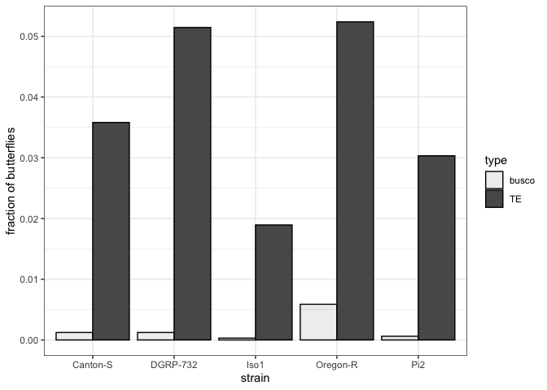

supp\_butterfly-busco-VS-TE
================
Filip Wierzbicki
8/22/2022

## Obtaining the butterfly signatures for genes/TEs in bash

Considering only annotations of at least 100bp length and a maximum
divergence of 10% from the TE consensus sequence, the scripts count
putative piRNA reads (23-29nt) from a prefiltered reads (for details see
butterfly-cor.Rmd) mapping to the corresponding genome assembly. Unique
piRNAs (min. mapping quality of 5) were counted in the neighboring 500bp
window.

``` bash
nohup sh -c 'for i in *sam;do n=${i%.sam};python /Volumes/Temp3/filip/trap_model/trapmodel/helper-scripts/butterfly_finder-genes.py --sam $i --bed /Volumes/Temp3/filip/trap_model/clusterscore/busco_bed/${n}_busco.bed --window 500 --minlen 100 --min-mq 5 --id ${n} > other-parameter/busco/${n}_w500.txt;done' &

nohup sh -c 'for i in *sam;do n=${i%.sam};python /Volumes/Temp3/filip/trap_model/trapmodel/helper-scripts/butterfly_finder-V2.py --sam $i --rm /Volumes/Temp3/filip/trap_model/whole-genome/repeatmasker/${n}.fasta.out --window 500 --minlen 100 --maxdiv 10.0 --min-mq 5 --id ${n} > other-parameter/TE/${n}_w500.txt;done' &
```

## Comparison of fraction of genes/TEs with butterfly signatures across strains

``` r
library(dplyr)
```

    ## 
    ## Attaching package: 'dplyr'

    ## The following objects are masked from 'package:stats':
    ## 
    ##     filter, lag

    ## The following objects are masked from 'package:base':
    ## 
    ##     intersect, setdiff, setequal, union

``` r
library(ggplot2)
library(ggpubr)

# butterfly signatures busco genes:
b1<-read.table("/Volumes/Temp3/filip/trap_model/butterfly/filtered-reads/map/other-parameter/busco/Canton-S_w500.txt")
names(b1)<-c("TE","chr","start","end","ls","la","rs","ra","strain")
b2<-read.table("/Volumes/Temp3/filip/trap_model/butterfly/filtered-reads/map/other-parameter/busco/DGRP-732_w500.txt")
names(b2)<-c("TE","chr","start","end","ls","la","rs","ra","strain")
b3<-read.table("/Volumes/Temp3/filip/trap_model/butterfly/filtered-reads/map/other-parameter/busco/Iso1_w500.txt")
names(b3)<-c("TE","chr","start","end","ls","la","rs","ra","strain")
b4<-read.table("/Volumes/Temp3/filip/trap_model/butterfly/filtered-reads/map/other-parameter/busco/Oregon-R_w500.txt")
names(b4)<-c("TE","chr","start","end","ls","la","rs","ra","strain")
b5<-read.table("/Volumes/Temp3/filip/trap_model/butterfly/filtered-reads/map/other-parameter/busco/Pi2_w500.txt")
names(b5)<-c("TE","chr","start","end","ls","la","rs","ra","strain")

th=15 #

ic=b1[FALSE,]

for(i in 1:nrow(b1)) {
  row <- b1[i,]
  if (row$la>=th && row$rs>=th){
    ic[nrow(ic) + 1,] <- row
  }
}

busco1<-ic
#
ic=b2[FALSE,]

for(i in 1:nrow(b2)) {
  row <- b2[i,]
  if (row$la>=th && row$rs>=th){
    ic[nrow(ic) + 1,] <- row
  }
}

busco2<-ic
#
ic=b3[FALSE,]

for(i in 1:nrow(b3)) {
  row <- b3[i,]
  if (row$la>=th && row$rs>=th){
    ic[nrow(ic) + 1,] <- row
  }
}

busco3<-ic
#
ic=b4[FALSE,]

for(i in 1:nrow(b4)) {
  row <- b4[i,]
  if (row$la>=th && row$rs>=th){
    ic[nrow(ic) + 1,] <- row
  }
}

busco4<-ic
#
ic=b5[FALSE,]

for(i in 1:nrow(b5)) {
  row <- b5[i,]
  if (row$la>=th && row$rs>=th){
    ic[nrow(ic) + 1,] <- row
  }
}

busco5<-ic

#summary that needs to be kept:
busco<-rbind(busco1,busco2,busco3,busco4,busco5)

for (sid in unique(busco$strain)) { 
  i <- busco$strain == sid
  a = nrow(subset(busco,strain==sid))
  busco$sum[i] = a
}
buscosum<-subset(busco,select=c("strain","sum"))
buscosum<-unique(buscosum)

buscosum$type<-c("busco")

#########################TEs

#butterfly signatures:
b1<-read.table("/Volumes/Temp3/filip/trap_model/butterfly/filtered-reads/map/other-parameter/TE/Canton-S_w500.txt")
names(b1)<-c("TE","chr","start","end","ls","la","rs","ra","strain")
b2<-read.table("/Volumes/Temp3/filip/trap_model/butterfly/filtered-reads/map/other-parameter/TE/DGRP-732_w500.txt")
names(b2)<-c("TE","chr","start","end","ls","la","rs","ra","strain")
b3<-read.table("/Volumes/Temp3/filip/trap_model/butterfly/filtered-reads/map/other-parameter/TE/Iso1_w500.txt")
names(b3)<-c("TE","chr","start","end","ls","la","rs","ra","strain")
b4<-read.table("/Volumes/Temp3/filip/trap_model/butterfly/filtered-reads/map/other-parameter/TE/Oregon-R_w500.txt")
names(b4)<-c("TE","chr","start","end","ls","la","rs","ra","strain")
b5<-read.table("/Volumes/Temp3/filip/trap_model/butterfly/filtered-reads/map/other-parameter/TE/Pi2_w500.txt")
names(b5)<-c("TE","chr","start","end","ls","la","rs","ra","strain")

#cluster annotations to exclude from butterfly signatures:
c1<-read.table("/Users/filipwierzbicki/Desktop/trap_model/analysis/abu/cusco_tas/gapped_combined-distinct/Canton-S_cluster.bed")
names(c1)<-c("chr","start","end","cluster","ig","ir")
c2<-read.table("/Users/filipwierzbicki/Desktop/trap_model/analysis/abu/cusco_tas/gapped_combined-distinct/DGRP-732_cluster.bed")
names(c2)<-c("chr","start","end","cluster","ig","ir")
c3<-read.table("/Users/filipwierzbicki/Desktop/trap_model/analysis/abu/cusco_tas/gapped_combined-distinct/Iso1_cluster.bed")
names(c3)<-c("chr","start","end","cluster","ig","ir")
c4<-read.table("/Users/filipwierzbicki/Desktop/trap_model/analysis/abu/cusco_tas/gapped_combined-distinct/Oregon-R_cluster.bed")
names(c4)<-c("chr","start","end","cluster","ig","ir")
c5<-read.table("/Users/filipwierzbicki/Desktop/trap_model/analysis/abu/cusco_tas/gapped_combined-distinct/Pi2_cluster.bed")
names(c5)<-c("chr","start","end","cluster","ig","ir")

c1$start<-c1$start+1
c1$end<-c1$end+1

c2$start<-c2$start+1
c2$end<-c2$end+1

c3$start<-c3$start+1
c3$end<-c3$end+1

c4$start<-c4$start+1
c4$end<-c4$end+1

c5$start<-c5$start+1
c5$end<-c5$end+1


b1$id<-paste(b1$TE,b1$chr,b1$start,b1$end,sep = "_")
b2$id<-paste(b2$TE,b2$chr,b2$start,b2$end,sep = "_")
b3$id<-paste(b3$TE,b3$chr,b3$start,b3$end,sep = "_")
b4$id<-paste(b4$TE,b4$chr,b4$start,b4$end,sep = "_")
b5$id<-paste(b5$TE,b5$chr,b5$start,b5$end,sep = "_")
###
#excluding signatures from clusters: 
ic=b1[FALSE,]

for(i in 1:nrow(b1)) {
  row <- b1[i,]

  for(k in 1:nrow(c1)){
    line <- c1[k,]
    if ((line$chr==row$chr && line$start<=row$start&&row$start<=line$end)||(line$chr==row$chr && line$start<=row$end&&row$end<=line$end)){
      ic[nrow(ic) + 1,] <- row
      break
    }
    
  }
}

nc<-anti_join(b1,ic,by="id")

ic=nc[FALSE,]

for(i in 1:nrow(nc)) {
  row <- nc[i,]
  if (row$la>=th && row$rs>=th){
    ic[nrow(ic) + 1,] <- row
  }
}

TE1<-ic
#

ic=b2[FALSE,]

for(i in 1:nrow(b2)) {
  row <- b2[i,]
  
  for(k in 1:nrow(c2)){
    line <- c2[k,]
    if ((line$chr==row$chr && line$start<=row$start&&row$start<=line$end)||(line$chr==row$chr && line$start<=row$end&&row$end<=line$end)){
      ic[nrow(ic) + 1,] <- row
      break
    }
    
  }
}

nc<-anti_join(b2,ic,by="id")

ic=nc[FALSE,]

for(i in 1:nrow(nc)) {
  row <- nc[i,]
  if (row$la>=th && row$rs>=th){
    ic[nrow(ic) + 1,] <- row
  }
}

TE2<-ic
#

ic=b3[FALSE,]

for(i in 1:nrow(b3)) {
  row <- b3[i,]
  
  for(k in 1:nrow(c3)){
    line <- c3[k,]
    if ((line$chr==row$chr && line$start<=row$start&&row$start<=line$end)||(line$chr==row$chr && line$start<=row$end&&row$end<=line$end)){
      ic[nrow(ic) + 1,] <- row
      break
    }
    
  }
}

nc<-anti_join(b3,ic,by="id")

ic=nc[FALSE,]

for(i in 1:nrow(nc)) {
  row <- nc[i,]
  if (row$la>=th && row$rs>=th){
    ic[nrow(ic) + 1,] <- row
  }
}

TE3<-ic
#

ic=b4[FALSE,]

for(i in 1:nrow(b4)) {
  row <- b4[i,]
  
  for(k in 1:nrow(c4)){
    line <- c4[k,]
    if ((line$chr==row$chr && line$start<=row$start&&row$start<=line$end)||(line$chr==row$chr && line$start<=row$end&&row$end<=line$end)){
      ic[nrow(ic) + 1,] <- row
      break
    }
    
  }
}

nc<-anti_join(b4,ic,by="id")

ic=nc[FALSE,]

for(i in 1:nrow(nc)) {
  row <- nc[i,]
  if (row$la>=th && row$rs>=th){
    ic[nrow(ic) + 1,] <- row
  }
}

TE4<-ic
#

ic=b5[FALSE,]

for(i in 1:nrow(b5)) {
  row <- b5[i,]
  
  for(k in 1:nrow(c5)){
    line <- c5[k,]
    if ((line$chr==row$chr && line$start<=row$start&&row$start<=line$end)||(line$chr==row$chr && line$start<=row$end&&row$end<=line$end)){
      ic[nrow(ic) + 1,] <- row
      break
    }
    
  }
}

nc<-anti_join(b5,ic,by="id")

ic=nc[FALSE,]

for(i in 1:nrow(nc)) {
  row <- nc[i,]
  if (row$la>=th && row$rs>=th){
    ic[nrow(ic) + 1,] <- row
  }
}

TE5<-ic
#summary that needs to be kept:
TE<-rbind(TE1,TE2,TE3,TE4,TE5)

for (sid in unique(TE$strain)) { 
  i <- TE$strain == sid
  a = nrow(subset(TE,strain==sid))
  TE$sum[i] = a
}
TEsum<-subset(TE,select=c("strain","sum"))
TEsum<-unique(TEsum)

TEsum$type<-c("TE")


bT<-rbind(buscosum,TEsum)
bT$id<-paste(bT$strain,bT$type,sep = "_")

###for butterfly signatures relative to all genes/TEs:

#busco:

b1<-read.table("/Volumes/Temp3/filip/trap_model/clusterscore/busco_bed/Canton-S_busco.bed")
b1$strain<-c("Canton-S")
b2<-read.table("/Volumes/Temp3/filip/trap_model/clusterscore/busco_bed/DGRP-732_busco.bed")
b2$strain<-c("DGRP-732")
b3<-read.table("/Volumes/Temp3/filip/trap_model/clusterscore/busco_bed/Iso1_busco.bed")
b3$strain<-c("Iso1")
b4<-read.table("/Volumes/Temp3/filip/trap_model/clusterscore/busco_bed/Oregon-R_busco.bed")
b4$strain<-c("Oregon-R")
b5<-read.table("/Volumes/Temp3/filip/trap_model/clusterscore/busco_bed/Pi2_busco.bed")
b5$strain<-c("Pi2")

b<-rbind(b1,b2,b3,b4,b5)

for (sid in unique(b$strain)) { 
  i <- b$strain == sid
  a = nrow(subset(b,strain==sid))
  b$sum[i] = a
}
abuscosum<-subset(b,select=c("strain","sum"))
abuscosum<-unique(abuscosum)

abuscosum$type<-c("busco")
abuscosum$id<-paste(abuscosum$strain,abuscosum$type,sep = "_")

#TE:
b1<-read.table("/Volumes/Temp3/filip/trap_model/whole-genome/repeatmasker/Canton-S.fasta.out",fill=TRUE)
b1$strain<-c("Canton-S")
b1<-subset(b1, select = -c(V16))
b2<-read.table("/Volumes/Temp3/filip/trap_model/whole-genome/repeatmasker/DGRP-732.fasta.out",fill=TRUE)
b2$strain<-c("DGRP-732")
#b2<-subset(b2, select = -c(V16))
b3<-read.table("/Volumes/Temp3/filip/trap_model/whole-genome/repeatmasker/Iso1.fasta.out",fill=TRUE)
b3$strain<-c("Iso1")
#b3<-subset(b3, select = -c(V16))
b4<-read.table("/Volumes/Temp3/filip/trap_model/whole-genome/repeatmasker/Oregon-R.fasta.out",fill=TRUE)
b4$strain<-c("Oregon-R")
b4<-subset(b4, select = -c(V16))
b5<-read.table("/Volumes/Temp3/filip/trap_model/whole-genome/repeatmasker/Pi2.fasta.out",fill=TRUE)
b5$strain<-c("Pi2")
b5<-subset(b5, select = -c(V16))
b<-rbind(b1,b2,b3,b4,b5)
b$div<-as.numeric(as.character(b$V2))
```

    ## Warning: NAs introduced by coercion

``` r
b<-subset(b,div<=10.0)
b$start<-as.numeric(as.character(b$V6))
b$end<-as.numeric(as.character(b$V7))
b$len<-b$end-b$start+1
b<-subset(b,len>=100)


for (sid in unique(b$strain)) { 
  i <- b$strain == sid
  a = nrow(subset(b,strain==sid))
  b$sum[i] = a
}
aTEsum<-subset(b,select=c("strain","sum"))
aTEsum<-unique(aTEsum)

aTEsum$type<-c("TE")
aTEsum$id<-paste(aTEsum$strain,aTEsum$type,sep = "_")


abT<-rbind(abuscosum,aTEsum)

frac<-inner_join(bT,abT,by="id")
frac$rel<-frac$sum.x/frac$sum.y

frac<-subset(frac,select=c("strain.x","type.x","rel"))
names(frac)<-c("strain","type","rel")

g<-ggplot(frac,aes(x=strain,y=rel,alpha=type))+geom_bar(stat="identity",position="dodge",color="black") +ylab("fraction of butterflies")+xlab("strain")+theme_bw()#+theme(legend.position='none')
plot(g)
```

    ## Warning: Using alpha for a discrete variable is not advised.

<!-- -->

``` r
ggsave("/Users/filipwierzbicki/Desktop/trap_model/analysis/abu/figures/supp_butterfly-busco_VS_TE-fraction-w500-th15.pdf",width=7,height=6)
```

    ## Warning: Using alpha for a discrete variable is not advised.

``` r
ggsave("/Users/filipwierzbicki/Desktop/trap_model/analysis/abu/figures/supp_butterfly-busco_VS_TE-fraction-w500-th15.png",width=7,height=6)
```

    ## Warning: Using alpha for a discrete variable is not advised.
