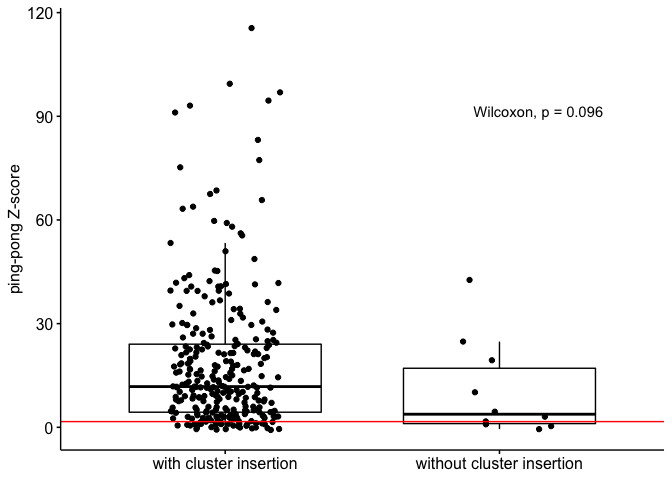

ping-pong\_zscores
================
Filip Wierzbicki
6/14/2023

``` bash
for i in *.sort.bam; do n=${i%.sort.bam}; samtools view $i | python2.7 /Volumes/Temp3/filip/programs/roberts_scripts/te-tools-code/piRNA/ping-pong-signature.py --sam - --max-mm 2 --sample-id ${n} > /Volumes/Temp3/filip/trap_model/pps/pps/${n}.pps ; done

cat *.pps|awk '$3=="s"' > forR/summary.pps.forR
```

``` r
library(ggplot2)
library(tidyverse)
```

    ## ── Attaching packages ─────────────────────────────────────── tidyverse 1.3.1 ──

    ## ✔ tibble  3.2.1     ✔ dplyr   1.1.2
    ## ✔ tidyr   1.1.4     ✔ stringr 1.4.0
    ## ✔ readr   2.0.2     ✔ forcats 0.5.1
    ## ✔ purrr   0.3.4

    ## ── Conflicts ────────────────────────────────────────── tidyverse_conflicts() ──
    ## ✖ dplyr::filter() masks stats::filter()
    ## ✖ dplyr::lag()    masks stats::lag()

``` r
library(ggpubr)

h<-read.table("/Volumes/Temp3/filip/trap_model/pps/pps/forR/summary.pps.forR")
names(h)<-c("sid","fam","strand","pos","pps")
h$sid<-as.factor(h$sid)

# h excluding 10 
h$key<-paste0(h$sid,"+",h$fam)
het<-subset(h,pos!=10)
hin<-subset(h,pos==10)

het<-het %>%group_by(sid,fam)%>% dplyr::summarise(mean=mean(pps),sd=sqrt(var(pps)),key=key[1])
```

    ## `summarise()` has grouped output by 'sid'. You can override using the `.groups`
    ## argument.

``` r
m<-merge(x=het,y=hin, by = "key")
m$zscore<-(m$pps-m$mean)/m$sd
m$zround<-round(m$zscore,2)
m$ppsround<-round(m$pps,2)
m$prob<-pnorm(m$zscore, mean = 0, sd = 1, lower.tail = FALSE)
m$probround<-signif(m$prob, digits=3)
m$sid<-m$sid.x
m$fam<-m$fam.x


t<-subset(m,select=c("sid","fam","zscore","zround","key"))

#######
###For population frequency Info based on Kofler et al. 2015 PLOS Genetics
info1<-read.table("/Users/filipwierzbicki/Desktop/evolution_cluster/temp/TEfamInfo_correct")
names(info1)<-c("name","fam","order","AF","popins")

###exclude somatically regulated TEs based on Malone et al. 2009 Cell
info1<-subset(info1,name!="gypsy10"&name!="gypsy"&name!="ZAM"&name!="gtwin"&name!="gypsy5"&name!="Tabor")

info<-subset(info1,select=c("fam","AF","name"))
info$AF<-round(info$AF,digits = 1)


ht<-left_join(t,info,by="fam")

#including AF threshold
ht<-subset(ht,AF!="NA")##remove missing AFs
ht<-subset(ht,AF<=0.2)

#ht<-subset(ht,select=c("name","Canton-S","DGRP-732","Iso1","Oregon-R","Pi2"))

############
b1<-read.table("/Volumes/Temp3/filip/trap_model/whole-genome/repeatmasker/Canton-S.fasta.out",fill=TRUE)
b1$strain<-c("Canton-S")
b1<-subset(b1, select = -c(V16))
b2<-read.table("/Volumes/Temp3/filip/trap_model/whole-genome/repeatmasker/DGRP-732.fasta.out",fill=TRUE)
b2$strain<-c("DGRP-732")
#b2<-subset(b2, select = -c(V16))
b3<-read.table("/Volumes/Temp3/filip/trap_model/whole-genome/repeatmasker/Iso1.fasta.out",fill=TRUE)
b3$strain<-c("Iso1")
#b3<-subset(b3, select = -c(V16))
b4<-read.table("/Volumes/Temp3/filip/trap_model/whole-genome/repeatmasker/Oregon-R.fasta.out",fill=TRUE)
b4$strain<-c("Oregon-R")
b4<-subset(b4, select = -c(V16))
b5<-read.table("/Volumes/Temp3/filip/trap_model/whole-genome/repeatmasker/Pi2.fasta.out",fill=TRUE)
b5$strain<-c("Pi2")
b5<-subset(b5, select = -c(V16))
b<-rbind(b1,b2,b3,b4,b5)
b$div<-as.numeric(as.character(b$V2))
```

    ## Warning: NAs introduced by coercion

``` r
b<-subset(b,div<=10.0)
b$start<-as.numeric(as.character(b$V6))
b$end<-as.numeric(as.character(b$V7))
b$len<-b$end-b$start+1
b<-subset(b,len>=100)
b$key<-paste0(b$strain,"+",b$V10)

for (sid in unique(b$key)) { 
  i <- b$key == sid
  a = nrow(subset(b,key==sid))
  b$sum[i] = a
}

TE<-subset(b,select=c("key","sum"))
TE<-unique(TE)
#TE<-subset(TE,sum>4)
######

htTE<-inner_join(ht,TE,by="key")
t<-subset(htTE,select=c("sid","name","zround")) #"fam"
#######

tx<-t %>% 
  group_by(sid) %>% 
  mutate(id = name) %>%  ##"fam"
  spread(sid, zround) %>%
  select(-id)

td<-as.data.frame(tx)
knitr::kable(td)
```

| name         | Canton-S | DGRP-732 |   Iso1 | Oregon-R |    Pi2 |
| :----------- | -------: | -------: | -----: | -------: | -----: |
| 17.6         |    12.11 |    23.49 |   4.91 |    59.72 |  16.47 |
| 1731         |    45.23 |    19.02 |  29.62 |    29.76 |  13.99 |
| 297          |    16.72 |    11.45 |  21.47 |     0.88 |   7.74 |
| 3S18         |    16.13 |    41.83 |   8.79 |    11.67 |   8.03 |
| 412          |    13.08 |     7.08 |  14.70 |    10.49 |   1.13 |
| accord       |     5.51 |    40.74 |   8.52 |     4.76 |  16.89 |
| accord2      |     0.96 |    22.26 |   1.53 |     3.55 |   0.35 |
| Bari1        |     0.86 |    22.95 |   1.00 |     4.51 |   1.07 |
| blood        |    41.46 |     3.51 |  48.70 |    24.11 |  20.89 |
| BS           |    11.61 |    67.52 |  23.10 |    21.13 |  20.46 |
| Burdock      |    10.82 |    38.71 |  21.69 |    28.17 |   8.02 |
| Circe        |    32.87 |    29.61 |  77.32 |    44.04 |  22.55 |
| copia        |     3.13 |    34.19 |  17.55 |    43.16 |   3.49 |
| diver        |    10.00 |    56.14 |  19.40 |    18.52 |   4.66 |
| Dm88         |     4.19 |    23.80 |   3.40 |     1.19 |   2.80 |
| Doc          |    30.18 |    63.24 |  35.13 |    83.16 |  21.52 |
| Doc2-element |     3.04 |    25.31 |   8.65 |     4.36 |   4.50 |
| F-element    |    27.08 |    41.36 |  91.09 |    11.75 |  25.28 |
| FB           |   \-0.54 |   \-0.32 | \-0.76 |     2.68 | \-0.53 |
| flea         |     9.61 |    18.56 |  42.64 |    14.47 |  10.25 |
| G2           |     7.82 |    25.98 |  40.80 |    23.39 |  11.71 |
| G6           |     2.21 |    29.60 |  20.31 |    13.80 |  10.83 |
| gypsy6       |     9.22 |     8.81 |   4.27 |     5.12 |  10.25 |
| HMS-Beagle   |    13.18 |    18.04 |  27.08 |    23.14 |  12.35 |
| HMS-Beagle2  |     3.81 |     2.57 |   0.89 |    15.04 |   0.78 |
| hobo         |     1.80 |    27.38 |   0.48 |     0.73 |   1.01 |
| hopper       |     2.50 |    96.92 |   8.33 |    11.55 |   0.53 |
| I-element    |     1.46 |    23.39 |   8.66 |     1.48 |   5.70 |
| Idefix       |     7.32 |    19.15 |   5.10 |     4.68 |   2.25 |
| invader3     |    16.23 |    55.52 |  21.18 |    53.34 |   9.00 |
| invader4     |     2.71 |     4.67 |   2.16 |    15.40 |   1.05 |
| invader6     |    25.47 |    26.30 |  18.35 |     2.76 |   5.11 |
| Ivk          |    42.31 |    12.66 |  94.54 |     4.26 |  17.97 |
| jockey       |    41.75 |    68.53 |  24.81 |    15.79 |  16.92 |
| Juan         |     5.97 |    16.48 |   4.90 |    17.59 |   3.93 |
| Max-element  |    14.52 |    22.52 |  50.95 |     8.78 |  23.89 |
| McClintock   |     6.04 |    11.94 |   8.72 |     3.04 |   2.42 |
| mdg1         |     1.63 |     3.00 |  10.34 |     8.09 |   0.89 |
| mdg3         |     5.84 |    11.03 |  13.58 |    18.22 |   7.17 |
| micropia     |    13.43 |    24.48 |  22.81 |     5.11 |  19.15 |
| NOF          |     0.93 |   \-0.49 | \-0.26 |   \-0.13 |   3.15 |
| opus         |    39.48 |    99.41 |  59.12 |   115.53 |  31.04 |
| P-element    |       NA |    40.73 |     NA |       NA |  15.24 |
| pogo         |     3.16 |     7.56 |   3.84 |     2.23 |   1.13 |
| Quasimodo    |     1.33 |     7.49 |  24.41 |    32.94 |  20.02 |
| R1A1-element |    39.52 |    39.46 |  93.09 |    75.23 |  63.84 |
| R2-element   |    21.58 |   \-0.53 |   3.07 |     0.35 |   1.71 |
| roo          |    13.43 |    30.60 |   9.04 |    19.81 |  11.56 |
| rover        |     1.83 |    21.69 |  18.44 |    10.28 |  12.72 |
| Rt1a         |    28.28 |    34.31 |  36.74 |    33.95 |  31.76 |
| Rt1b         |    24.93 |     9.69 |  28.68 |    58.05 |  17.79 |
| S-element    |   \-0.06 |    21.17 |  10.75 |    14.80 | \-0.66 |
| springer     |    11.84 |     2.71 |   2.01 |   \-0.07 |  37.91 |
| Stalker      |    11.47 |     9.20 |  14.76 |     2.03 |  11.80 |
| Stalker2     |     0.44 |     5.94 |   2.98 |     0.52 |   0.04 |
| Stalker4     |     8.17 |    11.48 |   9.93 |    16.86 |   5.78 |
| Tirant       |       NA |    11.73 |  10.14 |     0.86 |   3.36 |
| transib2     |     4.40 |    39.57 |   4.94 |     5.71 |   3.19 |
| Transpac     |     5.05 |    36.17 |  10.59 |     7.56 |   4.61 |
| X-element    |    21.93 |    65.76 |  15.82 |    45.37 |  36.25 |

``` r
write.table(td,file="/Volumes/Temp3/filip/trap_model/pps/results/zscores.txt",quote = FALSE, row.names = FALSE)

############
##cusco+TAS
t1<-read.table("/Users/filipwierzbicki/Desktop/trap_model/analysis/abu/cusco_tas/gapped_combined-distinct/Canton-S_gapped_cusco_tas_summary.forR")
t2<-read.table("/Users/filipwierzbicki/Desktop/trap_model/analysis/abu/cusco_tas/gapped_combined-distinct/DGRP-732_gapped_cusco_tas_summary.forR")
t3<-read.table("/Users/filipwierzbicki/Desktop/trap_model/analysis/abu/cusco_tas/gapped_combined-distinct/Iso1_gapped_cusco_tas_summary.forR")
t4<-read.table("/Users/filipwierzbicki/Desktop/trap_model/analysis/abu/cusco_tas/gapped_combined-distinct/Oregon-R_gapped_cusco_tas_summary.forR")
t5<-read.table("/Users/filipwierzbicki/Desktop/trap_model/analysis/abu/cusco_tas/gapped_combined-distinct/Pi2_gapped_cusco_tas_summary.forR")


tq<-rbind(t1,t2,t3,t4,t5)
names(tq)<-c("count","id","fam","region")

ht<-tq
ht$id2<-paste(ht$id,ht$fam,sep="+")

cl<-subset(ht,region=="cluster")
cl<-subset(cl,select=c("count","id2"))

rest<-subset(ht,region!="cluster")
rest<-subset(rest,select=c("count","id2"))
for (sid in unique(rest$id2)) { 
  i <- rest$id2 == sid
  a = sum(rest$count[i])
  rest$sum[i] = a
}
rest<-subset(rest,select=c("sum","id2"))
names(rest)<-c("count","id2")
rest<-unique(rest)

cr<-full_join(cl,rest,by="id2")
names(cr)<-c("cluster","id2","noncluster")

cr$id<-gsub("\\+.*","",cr$id2)
cr$fam<-gsub(".*\\+","",cr$id2)
ht<-cr
ht<-left_join(ht,info,by="fam")

#including AF threshold
ht<-subset(ht,AF!="NA")##remove missing AFs
ht<-subset(ht,AF<=0.2)

ht[is.na(ht)] <- 0

missing<-subset(ht,cluster==0)

for (row in 1:nrow(htTE)) { 
  if (htTE$key[row] %in% missing$id2){
    htTE$missing[row]<-c("without cluster insertion")
  } else {
    htTE$missing[row]<-c("with cluster insertion")
  }
}

#compare_means(zscore ~ missing, data = htTE)
p <- ggboxplot(htTE, x = "missing", y = "zscore",add = "jitter")+xlab("missing piRNA cluster insertions")+ylab("ping-pong Z-score")+geom_hline(yintercept = 1.65,color="red")+theme(axis.title.x=element_blank())
p + stat_compare_means(label.x = 2, label.y = 90)
```

<!-- -->

``` r
ggsave("/Volumes/Temp3/filip/trap_model/pps/results/figures/zscores.pdf",width=8,height=7)
ggsave("/Volumes/Temp3/filip/trap_model/pps/results/figures/zscores.png",width=8,height=7)

x<-subset(htTE,missing=="with cluster insertion")
y<-subset(htTE,missing=="without cluster insertion")
wilcox.test(x$zscore,y$zscore)
```

    ## 
    ##  Wilcoxon rank sum test with continuity correction
    ## 
    ## data:  x$zscore and y$zscore
    ## W = 1874, p-value = 0.09552
    ## alternative hypothesis: true location shift is not equal to 0
