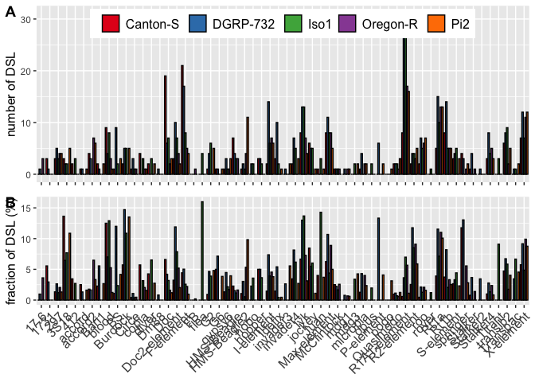

supp\_butterfly-heterogeneity
================
Filip Wierzbicki
11/7/2022

This script plots the heterogeneity of buttefly abundance among TEs and
fly strains. Note that the preprocessing steps can be found in the
script from the main butterfly figure.

``` r
library(dplyr)
```

    ## 
    ## Attaching package: 'dplyr'

    ## The following objects are masked from 'package:stats':
    ## 
    ##     filter, lag

    ## The following objects are masked from 'package:base':
    ## 
    ##     intersect, setdiff, setequal, union

``` r
library(ggplot2)
library(ggpubr)


#butterfly signatures:
TE1<-read.table("/Users/filipwierzbicki/Desktop/trap_model/analysis/abu/butterfly/signatures/output-V3/TE/filtered/Canton-S_w500.txt")
names(TE1)<-c("TE","chr","start","end","ls","la","rs","ra","strain")
TE2<-read.table("/Users/filipwierzbicki/Desktop/trap_model/analysis/abu/butterfly/signatures/output-V3/TE/filtered/DGRP-732_w500.txt")
names(TE2)<-c("TE","chr","start","end","ls","la","rs","ra","strain")
TE3<-read.table("/Users/filipwierzbicki/Desktop/trap_model/analysis/abu/butterfly/signatures/output-V3/TE/filtered/Iso1_w500.txt")
names(TE3)<-c("TE","chr","start","end","ls","la","rs","ra","strain")
TE4<-read.table("/Users/filipwierzbicki/Desktop/trap_model/analysis/abu/butterfly/signatures/output-V3/TE/filtered/Oregon-R_w500.txt")
names(TE4)<-c("TE","chr","start","end","ls","la","rs","ra","strain")
TE5<-read.table("/Users/filipwierzbicki/Desktop/trap_model/analysis/abu/butterfly/signatures/output-V3/TE/filtered/Pi2_w500.txt")
names(TE5)<-c("TE","chr","start","end","ls","la","rs","ra","strain")


#summary that needs to be kept:
#######
###For population frequency Info based on Kofler et al. 2015 PLOS Genetics
info1<-read.table("/Users/filipwierzbicki/Desktop/evolution_cluster/temp/TEfamInfo_correct")
names(info1)<-c("name","TE","order","AF","popins")

###exclude somatically regulated TEs based on Malone et al. 2009 Cell
info1<-subset(info1,name!="gypsy10"&name!="gypsy"&name!="ZAM"&name!="gtwin"&name!="gypsy5"&name!="Tabor")

info<-subset(info1,select=c("TE","AF"))
info$AF<-round(info$AF,digits = 1)


#####add missing data as 0s:
infoTE<-as.data.frame(info$TE)
names(infoTE)<-c("TE")
TE1m<-anti_join(infoTE,TE1,by="TE")
TE1m$strain<-c("Canton-S")
TE1m$sum<-c(0)

TE2m<-anti_join(infoTE,TE2,by="TE")
TE2m$strain<-c("DGRP-732")
TE2m$sum<-c(0)

TE3m<-anti_join(infoTE,TE3,by="TE")
TE3m$strain<-c("Iso1")
TE3m$sum<-c(0)

TE4m<-anti_join(infoTE,TE4,by="TE")
TE4m$strain<-c("Oregon-R")
TE4m$sum<-c(0)

TE5m<-anti_join(infoTE,TE5,by="TE")
TE5m$strain<-c("Pi2")
TE5m$sum<-c(0)
#average across assemblies:
t<-rbind(TE1,TE2,TE3,TE4,TE5)


####
t<-left_join(t,info,by="TE")

#including AF threshold
t<-subset(t,AF!="NA")##remove missing AFs
t<-subset(t,AF<=0.2)

t[is.na(t)] <- 0


t$id2<-paste(t$strain,t$TE,sep = "_")


for (sid in unique(t$id2)) { 
  i <- t$id2 == sid
  a = nrow(subset(t,id2==sid))
  t$sum[i] = a
}
TEsum<-subset(t,select=c("TE","strain","sum"))
TEsum<-unique(TEsum)

bT<-rbind(TEsum,TE1m,TE2m,TE3m,TE4m,TE5m)


#TE:
b1<-read.table("/Volumes/Temp3/filip/trap_model/whole-genome/repeatmasker/Canton-S.fasta.out",fill=TRUE)
b1$strain<-c("Canton-S")
b1<-subset(b1, select = -c(V16))
b2<-read.table("/Volumes/Temp3/filip/trap_model/whole-genome/repeatmasker/DGRP-732.fasta.out",fill=TRUE)
b2$strain<-c("DGRP-732")
#b2<-subset(b2, select = -c(V16))
b3<-read.table("/Volumes/Temp3/filip/trap_model/whole-genome/repeatmasker/Iso1.fasta.out",fill=TRUE)
b3$strain<-c("Iso1")
#b3<-subset(b3, select = -c(V16))
b4<-read.table("/Volumes/Temp3/filip/trap_model/whole-genome/repeatmasker/Oregon-R.fasta.out",fill=TRUE)
b4$strain<-c("Oregon-R")
b4<-subset(b4, select = -c(V16))
b5<-read.table("/Volumes/Temp3/filip/trap_model/whole-genome/repeatmasker/Pi2.fasta.out",fill=TRUE)
b5$strain<-c("Pi2")
b5<-subset(b5, select = -c(V16))
b<-rbind(b1,b2,b3,b4,b5)
b$div<-as.numeric(as.character(b$V2))
```

    ## Warning: NAs introduced by coercion

``` r
b<-subset(b,div<=10.0)
b$start<-as.numeric(as.character(b$V6))
b$end<-as.numeric(as.character(b$V7))
b$len<-b$end-b$start+1
b<-subset(b,len>=100)


b$id2<-paste(b$strain,b$V10,sep = "_")

for (sid in unique(b$id2)) { 
  i <- b$id2 == sid
  a = nrow(subset(b,id2==sid))
  b$sum[i] = a
}
aTEsum<-subset(b,select=c("strain","V10","sum"))
aTEsum<-unique(aTEsum)

abT<-aTEsum
names(abT)<-c("strain","TE","sum")


bT$id<-paste(bT$strain,bT$TE,sep = "_")
abT$id<-paste(abT$strain,abT$TE,sep = "_")


frac<-left_join(bT,abT,by="id")
frac$rel<-frac$sum.x/frac$sum.y
frac[is.na(frac)] <- 0
```

    ## Warning in `[<-.factor`(`*tmp*`, thisvar, value = 0): invalid factor level, NA
    ## generated

``` r
frac<-subset(frac,select=c("strain.x","TE.x","rel","sum.x"))
names(frac)<-c("strain","TE","rel","sum")

TEname<-read.table("/Users/filipwierzbicki/Desktop/evolution_cluster/easyfig-pipeline_sourceforge/resources/TE_dmel_3-names")
names(TEname)<-c("TE","abbr","family")

frac<-left_join(frac,TEname,by="TE")

for (sid in unique(frac$TE)) { 
  i <- frac$TE == sid
  a = sum(frac$sum[i])
  frac$sumsum[i] = a
}

frac<-subset(frac,sumsum!=0)

abs<-ggplot(frac, aes(x=family, y=sum))+geom_boxplot() 
abs<-abs+theme(axis.text.x = element_text(angle = 45,hjust=1),axis.title.x=element_blank())+ylab("number of DSL")

ga<-ggplot(frac,aes(x=family,y=sum,fill=strain))+geom_bar(stat="identity",position="dodge",color="black")+ylab("number of DSL")+theme(axis.title.x=element_blank(),axis.text.x=element_blank(),legend.position="top",legend.title = element_blank())

rel<-ggplot(frac, aes(x=family, y=rel))+geom_boxplot() 
rel<-rel+theme(axis.text.x = element_text(angle = 45,hjust=1),axis.title.x=element_blank())+ylab("fraction of DSL")

gr<-ggplot(frac,aes(x=family,y=rel*100,fill=strain))+geom_bar(stat="identity",position="dodge",color="black")+ylab("fraction of DSL (%)")+theme(axis.text.x = element_text(angle = 45,hjust=1),axis.title.x=element_blank(),legend.position="None")

g<-ggarrange(ga,gr,
             labels = c("A", "B"),
             ncol = 1, nrow = 2)
plot(g)
```

<!-- -->

``` r
ggsave("/Users/filipwierzbicki/Desktop/trap_model/analysis/abu/figures/butterfly-heterogeneity.pdf",width=12,height=6)
ggsave("/Users/filipwierzbicki/Desktop/trap_model/analysis/abu/figures/butterfly-heterogeneity.png",width=12,height=6)
```
