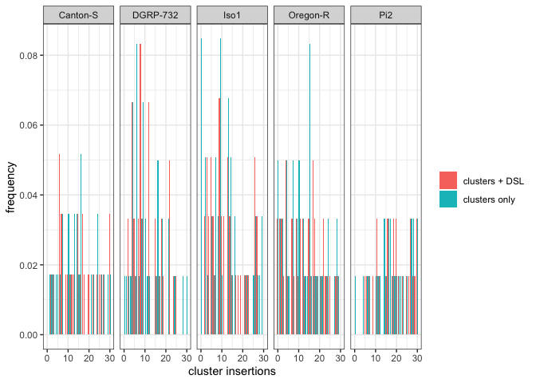

supp\_separate\_histograms-with\_butteflies
================
Filip Wierzbicki
11/29/2022

``` r
library(dplyr)
```

    ## 
    ## Attaching package: 'dplyr'

    ## The following objects are masked from 'package:stats':
    ## 
    ##     filter, lag

    ## The following objects are masked from 'package:base':
    ## 
    ##     intersect, setdiff, setequal, union

``` r
library(ggplot2)
library(ggpubr)

dsl<-read.table("/Users/filipwierzbicki/Desktop/trap_model/analysis/abu/butterfly/signatures/output-V3/TE/filtered/forR/TE_w500.forR")
names(dsl)<-c("TE","chr","start","end","ls","la","rs","ra","strain")

a1<-read.table("/Users/filipwierzbicki/Desktop/trap_model/analysis/abu/cusco_tas/gapped_combined-distinct/Canton-S_gapped_cusco_tas_summary.forR")
a2<-read.table("/Users/filipwierzbicki/Desktop/trap_model/analysis/abu/cusco_tas/gapped_combined-distinct/DGRP-732_gapped_cusco_tas_summary.forR")
a3<-read.table("/Users/filipwierzbicki/Desktop/trap_model/analysis/abu/cusco_tas/gapped_combined-distinct/Iso1_gapped_cusco_tas_summary.forR")
a4<-read.table("/Users/filipwierzbicki/Desktop/trap_model/analysis/abu/cusco_tas/gapped_combined-distinct/Oregon-R_gapped_cusco_tas_summary.forR")
a5<-read.table("/Users/filipwierzbicki/Desktop/trap_model/analysis/abu/cusco_tas/gapped_combined-distinct/Pi2_gapped_cusco_tas_summary.forR")
a<-rbind(a1,a2,a3,a4,a5)
names(a)<-c("count","strain","TE","region")
a$id<-paste(a$strain,a$TE,sep="+")

###
ic<-dsl
ic$id<-paste(ic$strain,ic$TE,sep="+")
for (sid in unique(ic$id)) { 
  i <- ic$id == sid
  x = nrow(subset(ic,ic$id==sid))
  ic$butterfly[i] = x
}
bfs<-subset(ic,select = c("butterfly","id"))
bfs<-unique(bfs)
ac<-subset(a,region=="cluster")
ac<-subset(ac,select=c("count","id"))
TE<-full_join(bfs,ac,by="id")
anc<-subset(a,region!="cluster")
anc<-subset(anc,select=c("count","id"))

for (sid in unique(anc$id)) { 
  i <- anc$id == sid
  a = sum(anc$count[i])
  anc$sum[i] = a
}
anc<-subset(anc,select=c("sum","id"))
anc<-unique(anc)

names(anc)<-c("rest","id")
TE<-full_join(TE,anc,by="id")

TE$strain<-gsub("\\+.*","",TE$id)
TE$TE<-gsub(".*\\+","",TE$id)

#######
###For population frequency Info based on Kofler et al. 2015 PLOS Genetics
info1<-read.table("/Users/filipwierzbicki/Desktop/evolution_cluster/temp/TEfamInfo_correct")
names(info1)<-c("name","TE","order","AF","popins")
###exclude somatically regulated TEs based on Malone et al. 2009 Cell
info1<-subset(info1,name!="gypsy10"&name!="gypsy"&name!="ZAM"&name!="gtwin"&name!="gypsy5"&name!="Tabor")
info<-subset(info1,select=c("TE","AF"))
info$AF<-round(info$AF,digits = 1)


####
t<-left_join(TE,info,by="TE")

#including AF threshold
t<-subset(t,AF!="NA")##remove missing AFs
t<-subset(t,AF<=0.2)

t[is.na(t)] <- 0
t$sum<-t$butterfly+t$count
tbut<-subset(t,select=c("TE","sum","strain"))
names(tbut)<-c("TE","cluster","strain")
tclu<-subset(t,select=c("TE","count","strain"))
names(tclu)<-c("TE","cluster","strain")

tbut$id3<-paste(tbut$cluster,tbut$strain,sep="_")
for (sid in unique(tbut$id3)) { 
  i <- tbut$id3 == sid
  a = nrow(subset(tbut,id3==sid))
  tbut$inds[i] = a
}

tbut<-subset(tbut,select=c("cluster","inds","strain"))
tbut<-unique(tbut)

for (sid in unique(tbut$strain)) { 
  i <- tbut$strain == sid
  tbut$indsrel[i]<-tbut$inds[i]/sum(tbut$inds[i])
}


tclu$id3<-paste(tclu$cluster,tclu$strain,sep="_")
for (sid in unique(tclu$id3)) { 
  i <- tclu$id3 == sid
  a = nrow(subset(tclu,id3==sid))
  tclu$inds[i] = a
}

tclu<-subset(tclu,select=c("cluster","inds","strain"))
tclu<-unique(tclu)

for (sid in unique(tclu$strain)) { 
  i <- tclu$strain == sid
  tclu$indsrel[i]<-tclu$inds[i]/sum(tclu$inds[i])
}


dfc1<-data.frame(cluster = 0:30,strain="Canton-S")
dfc2<-data.frame(cluster = 0:30,strain="DGRP-732")
dfc3<-data.frame(cluster = 0:30,strain="Iso1")
dfc4<-data.frame(cluster = 0:30,strain="Oregon-R")
dfc5<-data.frame(cluster = 0:30,strain="Pi2")
dfc<-rbind(dfc1,dfc2,dfc3,dfc4,dfc5)
dfc$id<-paste(dfc$cluster,dfc$strain,sep = "_")

tbut$id<-paste(tbut$cluster,tbut$strain,sep = "_")
tclu$id<-paste(tclu$cluster,tclu$strain,sep = "_")

tbut<-left_join(dfc,tbut,by="id")
tclu<-left_join(dfc,tclu,by="id")

tbut$type<-c("clusters + DSL")
tclu$type<-c("clusters only")

t<-rbind(tclu,tbut)
t[is.na(t)] <- 0
ghis<-ggplot(t, aes(x=cluster.x, y=indsrel,fill=type))+ geom_bar(stat="identity",position = "dodge")+facet_wrap(~strain.x,ncol = 5)+ylab("frequency")+xlab("cluster insertions")+
  theme_bw()+theme(legend.position="right")+scale_fill_discrete(name=NULL)#+ coord_cartesian(xlim = c(0, 30))#, expand = FALSE#+xlim(-1,31)


plot(ghis)
```

<!-- -->

``` r
ggsave("/Users/filipwierzbicki/Desktop/trap_model/analysis/abu/figures/supp_butterfly-histo.pdf",width=12,height=3)
ggsave("/Users/filipwierzbicki/Desktop/trap_model/analysis/abu/figures/supp_butterfly-histo.png",width=12,height=3)
```
