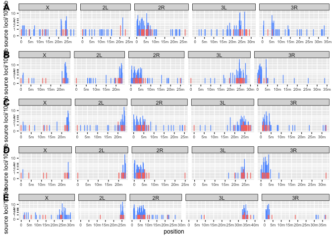

supp\_butterfly-onChr
================
Filip Wierzbicki
9/30/2022

This script generates a plot of butterfly signatures along the genome in
each strains.

The code to generate the input files can be found in the
butterfly-main.Rmd

``` r
library(dplyr)
```

    ## 
    ## Attaching package: 'dplyr'

    ## The following objects are masked from 'package:stats':
    ## 
    ##     filter, lag

    ## The following objects are masked from 'package:base':
    ## 
    ##     intersect, setdiff, setequal, union

``` r
library(ggplot2)
library(ggpubr)
options(digits=15)
ws=100000

##the filter with this Info table is not used here since its rather a demonstration than the trap model test:
##(Note in the analysis we filter for germline TEs with low population frequencies)
#######
###For population frequency Info based on Kofler et al. 2015 PLOS Genetics
info1<-read.table("/Users/filipwierzbicki/Desktop/evolution_cluster/temp/TEfamInfo_correct")
names(info1)<-c("name","TE","order","AF","popins")
###exclude somatically regulated TEs based on Malone et al. 2009 Cell
info1<-subset(info1,name!="gypsy10"&name!="gypsy"&name!="ZAM"&name!="gtwin"&name!="gypsy5"&name!="Tabor")
info<-subset(info1,select=c("TE","AF"))
info$AF<-round(info$AF,digits = 1)
infoP<-subset(info1,select=c("name","AF"))
infoP$AF<-round(infoP$AF,digits = 1)
names(infoP)<-c("TE","AF")

b2ch<-read.table("/Users/filipwierzbicki/Desktop/trap_model/data/core/chromosome-names/DGRP-732.tsv")
b4ch<-read.table("/Users/filipwierzbicki/Desktop/trap_model/data/core/chromosome-names/Oregon-R.tsv")

#butterfly signatures:
b1<-read.table("/Users/filipwierzbicki/Desktop/trap_model/analysis/abu/butterfly/signatures/output-V3/TE/filtered/Canton-S_w500.txt")
names(b1)<-c("TE","chr","start","end","ls","la","rs","ra","strain")
b1$pos<-b1$start+((b1$end-b1$start)/2)
b1$chromo<-gsub("_RaGOO","",b1$chr)
b1$signal<-b1$ls+b1$la+b1$rs+b1$ra

b2<-read.table("/Users/filipwierzbicki/Desktop/trap_model/analysis/abu/butterfly/signatures/output-V3/TE/filtered/DGRP-732_w500.txt")
b2<-left_join(b2,b2ch,by="V2")
names(b2)<-c("TE","accession","start","end","ls","la","rs","ra","strain","chr")
b2<-subset(b2,select=c("TE","chr","start","end","ls","la","rs","ra","strain"))
b2$pos<-b2$start+((b2$end-b2$start)/2)
b2$chromo<-b2$chr
b2$signal<-b2$ls+b2$la+b2$rs+b2$ra

b3<-read.table("/Users/filipwierzbicki/Desktop/trap_model/analysis/abu/butterfly/signatures/output-V3/TE/filtered/Iso1_w500.txt")
names(b3)<-c("TE","chr","start","end","ls","la","rs","ra","strain")
#chromosomes are good to go!
b3$pos<-b3$start+((b3$end-b3$start)/2)
b3$chromo<-b3$chr
b3$signal<-b3$ls+b3$la+b3$rs+b3$ra

b4<-read.table("/Users/filipwierzbicki/Desktop/trap_model/analysis/abu/butterfly/signatures/output-V3/TE/filtered/Oregon-R_w500.txt")
b4<-left_join(b4,b4ch,by="V2")
names(b4)<-c("TE","accession","start","end","ls","la","rs","ra","strain","chr")
b4<-subset(b4,select=c("TE","chr","start","end","ls","la","rs","ra","strain"))
b4$pos<-b4$start+((b4$end-b4$start)/2)
b4$chromo<-b4$chr
b4$signal<-b4$ls+b4$la+b4$rs+b4$ra

b5<-read.table("/Users/filipwierzbicki/Desktop/trap_model/analysis/abu/butterfly/signatures/output-V3/TE/filtered/Pi2_w500.txt")
names(b5)<-c("TE","chr","start","end","ls","la","rs","ra","strain")
b5$pos<-b5$start+((b5$end-b5$start)/2)
b5$chromo<-gsub("_RaGOO","",b5$chr)
b5$signal<-b5$ls+b5$la+b5$rs+b5$ra

#cluster annotations:
c1<-read.table("/Users/filipwierzbicki/Desktop/trap_model/analysis/abu/cusco_tas/gapped_combined-distinct/Canton-S_cluster.bed")
names(c1)<-c("chr","start","end","cluster","ig","ir")
c1$chromo<-gsub("_RaGOO","",c1$chr)

c2<-read.table("/Users/filipwierzbicki/Desktop/trap_model/analysis/abu/cusco_tas/gapped_combined-distinct/DGRP-732_cluster.bed")
c2<-left_join(c2,b2ch, by = c("V1" = "V2"))
names(c2)<-c("chr","start","end","cluster","ig","ir","chromo")

c3<-read.table("/Users/filipwierzbicki/Desktop/trap_model/analysis/abu/cusco_tas/gapped_combined-distinct/Iso1_cluster.bed")
names(c3)<-c("chr","start","end","cluster","ig","ir")
#chromosomes are good to go!
c3$chromo<-c3$chr

c4<-read.table("/Users/filipwierzbicki/Desktop/trap_model/analysis/abu/cusco_tas/gapped_combined-distinct/Oregon-R_cluster.bed")
c4<-left_join(c4,b4ch, by = c("V1" = "V2"))
names(c4)<-c("chr","start","end","cluster","ig","ir","chromo")

c5<-read.table("/Users/filipwierzbicki/Desktop/trap_model/analysis/abu/cusco_tas/gapped_combined-distinct/Pi2_cluster.bed")
names(c5)<-c("chr","start","end","cluster","ig","ir")
c5$chromo<-gsub("_RaGOO","",c5$chr)

c1$start<-c1$start+1
c1$end<-c1$end+1

c2$start<-c2$start+1
c2$end<-c2$end+1

c3$start<-c3$start+1
c3$end<-c3$end+1

c4$start<-c4$start+1
c4$end<-c4$end+1

c5$start<-c5$start+1
c5$end<-c5$end+1


tb1<-subset(b1,chromo=="2L"|chromo=="2R"|chromo=="3L"|chromo=="3R"|chromo=="X")
tb1$chr_f = factor(tb1$chromo, levels=c('X','2L','2R','3L','3R'))

tb1<-subset(tb1,select=c("chr_f","pos"))
tb1$type<-c("stand-alone")
c1$pos<-c1$start+((c1$end-c1$start)/2)
c1x<-subset(c1,chromo=="2L"|chromo=="2R"|chromo=="3L"|chromo=="3R"|chromo=="X")
c1x$chr_f = factor(c1x$chromo, levels=c('X','2L','2R','3L','3R'))
c1x<-subset(c1x,select=c("chr_f","pos"))
c1x$type<-c("cluster")
tb1<-rbind(tb1,c1x)
#
###
tb1$pos<-as.integer(tb1$pos/ws)*ws
tb1$id<-paste(tb1$chr_f,tb1$pos,tb1$type,sep = "+")

for (sid in unique(tb1$id)) { 
  i <- tb1$id == sid
  a = nrow(subset(tb1,id==sid))
  tb1$sum[i] = a
}

tb1<-unique(tb1)
tb1<-subset(tb1,select=c("chr_f","pos","type","sum"))
####add first and last position of contig
ct1<-read.table("/Users/filipwierzbicki/Desktop/trap_model/analysis/abu/ref/ref_recover/helper_files/Canton-S_contigs.txt")
names(ct1)<-c("chromo","name","last")
ct1$first<-c(1)
ct1<-subset(ct1,chromo=="2L"|chromo=="2R"|chromo=="3L"|chromo=="3R"|chromo=="X")
ct1$chr_f = factor(ct1$chromo, levels=c('X','2L','2R','3L','3R'))
ct1f<-subset(ct1,select=c("chr_f","first"))
names(ct1f)<-c("chr_f","pos")
ct1l<-subset(ct1,select=c("chr_f","last"))
names(ct1l)<-c("chr_f","pos")
ct1<-rbind(ct1f,ct1l)
ct1$type<-c("end-points")
ct1$sum<-c(0)
tb1<-rbind(tb1,ct1)
###

tb2<-subset(b2,chromo=="2L"|chromo=="2R"|chromo=="3L"|chromo=="3R"|chromo=="X")
tb2$chr_f = factor(tb2$chromo, levels=c('X','2L','2R','3L','3R'))

tb2<-subset(tb2,select=c("chr_f","pos"))
tb2$type<-c("stand-alone")
c2$pos<-c2$start+((c2$end-c2$start)/2)
c1x<-subset(c2,chromo=="2L"|chromo=="2R"|chromo=="3L"|chromo=="3R"|chromo=="X")
c1x$chr_f = factor(c1x$chromo, levels=c('X','2L','2R','3L','3R'))
c1x<-subset(c1x,select=c("chr_f","pos"))
c1x$type<-c("cluster")
tb2<-rbind(tb2,c1x)
#
###
tb2$pos<-as.integer(tb2$pos/ws)*ws
tb2$id<-paste(tb2$chr_f,tb2$pos,tb2$type,sep = "+")

for (sid in unique(tb2$id)) { 
  i <- tb2$id == sid
  a = nrow(subset(tb2,id==sid))
  tb2$sum[i] = a
}

tb2<-unique(tb2)
tb2<-subset(tb2,select=c("chr_f","pos","type","sum"))
####add first and last position of contig
ct2<-read.table("/Users/filipwierzbicki/Desktop/trap_model/analysis/abu/ref/ref_recover/helper_files/DGRP-732_contigs.txt")
names(ct2)<-c("chromo","name","last")
ct2$first<-c(1)
ct2<-subset(ct2,chromo=="2L"|chromo=="2R"|chromo=="3L"|chromo=="3R"|chromo=="X")
ct2$chr_f = factor(ct2$chromo, levels=c('X','2L','2R','3L','3R'))
ct2f<-subset(ct2,select=c("chr_f","first"))
names(ct2f)<-c("chr_f","pos")
ct2l<-subset(ct2,select=c("chr_f","last"))
names(ct2l)<-c("chr_f","pos")
ct2<-rbind(ct2f,ct2l)
ct2$type<-c("end-points")
ct2$sum<-c(0)
tb2<-rbind(tb2,ct2)
###

tb3<-subset(b3,chromo=="2L"|chromo=="2R"|chromo=="3L"|chromo=="3R"|chromo=="X")
tb3$chr_f = factor(tb3$chromo, levels=c('X','2L','2R','3L','3R'))

tb3<-subset(tb3,select=c("chr_f","pos"))
tb3$type<-c("stand-alone")
c3$pos<-c3$start+((c3$end-c3$start)/2)
c1x<-subset(c3,chromo=="2L"|chromo=="2R"|chromo=="3L"|chromo=="3R"|chromo=="X")
c1x$chr_f = factor(c1x$chromo, levels=c('X','2L','2R','3L','3R'))
c1x<-subset(c1x,select=c("chr_f","pos"))
c1x$type<-c("cluster")
tb3<-rbind(tb3,c1x)
#
###
tb3$pos<-as.integer(tb3$pos/ws)*ws
tb3$id<-paste(tb3$chr_f,tb3$pos,tb3$type,sep = "+")

for (sid in unique(tb3$id)) { 
  i <- tb3$id == sid
  a = nrow(subset(tb3,id==sid))
  tb3$sum[i] = a
}

tb3<-unique(tb3)
tb3<-subset(tb3,select=c("chr_f","pos","type","sum"))
####add first and last position of contig
ct3<-read.table("/Users/filipwierzbicki/Desktop/trap_model/analysis/abu/ref/ref_recover/helper_files/Iso1_contigs.txt")
names(ct3)<-c("chromo","name","last")
ct3$first<-c(1)
ct3<-subset(ct3,chromo=="2L"|chromo=="2R"|chromo=="3L"|chromo=="3R"|chromo=="X")
ct3$chr_f = factor(ct3$chromo, levels=c('X','2L','2R','3L','3R'))
ct3f<-subset(ct3,select=c("chr_f","first"))
names(ct3f)<-c("chr_f","pos")
ct3l<-subset(ct3,select=c("chr_f","last"))
names(ct3l)<-c("chr_f","pos")
ct3<-rbind(ct3f,ct3l)
ct3$type<-c("end-points")
ct3$sum<-c(0)
tb3<-rbind(tb3,ct3)
###

tb4<-subset(b4,chromo=="2L"|chromo=="2R"|chromo=="3L"|chromo=="3R"|chromo=="X")
tb4$chr_f = factor(tb4$chromo, levels=c('X','2L','2R','3L','3R'))

tb4<-subset(tb4,select=c("chr_f","pos"))
tb4$type<-c("stand-alone")
c4$pos<-c4$start+((c4$end-c4$start)/2)
c1x<-subset(c4,chromo=="2L"|chromo=="2R"|chromo=="3L"|chromo=="3R"|chromo=="X")
c1x$chr_f = factor(c1x$chromo, levels=c('X','2L','2R','3L','3R'))
c1x<-subset(c1x,select=c("chr_f","pos"))
c1x$type<-c("cluster")
tb4<-rbind(tb4,c1x)
#
###
tb4$pos<-as.integer(tb4$pos/ws)*ws
tb4$id<-paste(tb4$chr_f,tb4$pos,tb4$type,sep = "+")

for (sid in unique(tb4$id)) { 
  i <- tb4$id == sid
  a = nrow(subset(tb4,id==sid))
  tb4$sum[i] = a
}

tb4<-unique(tb4)
tb4<-subset(tb4,select=c("chr_f","pos","type","sum"))
####add first and last position of contig
ct4<-read.table("/Users/filipwierzbicki/Desktop/trap_model/analysis/abu/ref/ref_recover/helper_files/Oregon-R_contigs.txt")
names(ct4)<-c("chromo","name","last")
ct4$first<-c(1)
ct4<-subset(ct4,chromo=="2L"|chromo=="2R"|chromo=="3L"|chromo=="3R"|chromo=="X")
ct4$chr_f = factor(ct4$chromo, levels=c('X','2L','2R','3L','3R'))
ct4f<-subset(ct4,select=c("chr_f","first"))
names(ct4f)<-c("chr_f","pos")
ct4l<-subset(ct4,select=c("chr_f","last"))
names(ct4l)<-c("chr_f","pos")
ct4<-rbind(ct4f,ct4l)
ct4$type<-c("end-points")
ct4$sum<-c(0)
tb4<-rbind(tb4,ct4)
###
##
ct5<-read.table("/Users/filipwierzbicki/Desktop/trap_model/analysis/abu/ref/ref_recover/helper_files/Pi2_contigs.txt")
names(ct5)<-c("chromo","name","last")
####
#reverse positions for 2L in in Pi2:
tb2L<-subset(b5,chromo=="2L")
tb2L$pos<-subset(ct5,chromo=="2L")$last-tb2L$pos+1
#####
tb5<-subset(b5,chromo=="2R"|chromo=="3L"|chromo=="3R"|chromo=="X")
tb5<-rbind(tb5,tb2L)#add 2L to the rest of the data
tb5$chr_f = factor(tb5$chromo, levels=c('X','2L','2R','3L','3R'))

tb5<-subset(tb5,select=c("chr_f","pos"))
tb5$type<-c("stand-alone")
c5$pos<-c5$start+((c5$end-c5$start)/2)
#
c52L<-subset(c5,chromo=="2L")
c52L$pos<-subset(ct5,chromo=="2L")$last-c52L$pos+1
#
c1x<-subset(c5,chromo=="2R"|chromo=="3L"|chromo=="3R"|chromo=="X")
c1x<-rbind(c1x,c52L)#add 2L to the rest of the data
c1x$chr_f = factor(c1x$chromo, levels=c('X','2L','2R','3L','3R'))
c1x<-subset(c1x,select=c("chr_f","pos"))
c1x$type<-c("cluster")
tb5<-rbind(tb5,c1x)
###
tb5$pos<-as.integer(tb5$pos/ws)*ws
tb5$id<-paste(tb5$chr_f,tb5$pos,tb5$type,sep = "+")

for (sid in unique(tb5$id)) { 
  i <- tb5$id == sid
  a = nrow(subset(tb5,id==sid))
  tb5$sum[i] = a
}

tb5<-unique(tb5)
tb5<-subset(tb5,select=c("chr_f","pos","type","sum"))
####add first and last position of contig
##
ct5$first<-c(1)
ct5<-subset(ct5,chromo=="2L"|chromo=="2R"|chromo=="3L"|chromo=="3R"|chromo=="X")
ct5$chr_f = factor(ct5$chromo, levels=c('X','2L','2R','3L','3R'))
ct5f<-subset(ct5,select=c("chr_f","first"))
names(ct5f)<-c("chr_f","pos")
ct5l<-subset(ct5,select=c("chr_f","last"))
names(ct5l)<-c("chr_f","pos")
ct5<-rbind(ct5f,ct5l)
ct5$type<-c("end-points")
ct5$sum<-c(0)
tb5<-rbind(tb5,ct5)
###

tb1$strain<-c("Canton-S")
tb2$strain<-c("DGRP-732")
tb3$strain<-c("Iso1")
tb4$strain<-c("Oregon-R")
tb5$strain<-c("Pi2")

pt1<-ggplot(tb1,aes(x=pos,y=log10(sum+1),color=type))+geom_segment(aes(xend=pos),yend=0)+facet_grid(~chr_f, scales="free_x", space = "free_x")+xlab("position")+ylab("source loci/100kb")+
  scale_x_continuous(breaks=c(0,5000000,10000000,15000000,20000000,25000000,30000000,35000000,40000000),labels=c("0","5m","10m","15m","20m","25m","30m","35m","40m"))+scale_y_continuous(breaks=c(0,0.30103,0.4771213,0.60206,0.69897,0.7781513,1.041393),labels=c("0","1","2","3","4","5","10"))+
  theme(axis.text=element_text(size=6),axis.title = element_text(size=9),axis.title.x = element_blank(),legend.position = "None", strip.background = element_rect(colour="black",size=0.5),strip.text = element_text(size=8,margin = margin(0.05, 0.05, 0.05, 0.05, "cm")))

pt2<-ggplot(tb2,aes(x=pos,y=log10(sum+1),color=type))+geom_segment(aes(xend=pos),yend=0)+facet_grid(~chr_f, scales="free_x", space = "free_x")+xlab("position")+ylab("source loci/100kb")+
  scale_x_continuous(breaks=c(0,5000000,10000000,15000000,20000000,25000000,30000000,35000000,40000000),labels=c("0","5m","10m","15m","20m","25m","30m","35m","40m"))+scale_y_continuous(breaks=c(0,0.30103,0.4771213,0.60206,0.69897,0.7781513,1.041393),labels=c("0","1","2","3","4","5","10"))+
  theme(axis.text=element_text(size=6),axis.title = element_text(size=9),axis.title.x = element_blank(),legend.position = "None", strip.background = element_rect(colour="black",size=0.5),strip.text = element_text(size=8,margin = margin(0.05, 0.05, 0.05, 0.05, "cm")))

pt3<-ggplot(tb3,aes(x=pos,y=log10(sum+1),color=type))+geom_segment(aes(xend=pos),yend=0)+facet_grid(~chr_f, scales="free_x", space = "free_x")+xlab("position")+ylab("source loci/100kb")+
  scale_x_continuous(breaks=c(0,5000000,10000000,15000000,20000000,25000000,30000000,35000000,40000000),labels=c("0","5m","10m","15m","20m","25m","30m","35m","40m"))+scale_y_continuous(breaks=c(0,0.30103,0.4771213,0.60206,0.69897,0.7781513,1.041393),labels=c("0","1","2","3","4","5","10"))+
  theme(axis.text=element_text(size=6),axis.title = element_text(size=9),axis.title.x = element_blank(),legend.position = "None", strip.background = element_rect(colour="black",size=0.5),strip.text = element_text(size=8,margin = margin(0.05, 0.05, 0.05, 0.05, "cm")))

pt4<-ggplot(tb4,aes(x=pos,y=log10(sum+1),color=type))+geom_segment(aes(xend=pos),yend=0)+facet_grid(~chr_f, scales="free_x", space = "free_x")+xlab("position")+ylab("source loci/100kb")+
  scale_x_continuous(breaks=c(0,5000000,10000000,15000000,20000000,25000000,30000000,35000000,40000000),labels=c("0","5m","10m","15m","20m","25m","30m","35m","40m"))+scale_y_continuous(breaks=c(0,0.30103,0.4771213,0.60206,0.69897,0.7781513,1.041393),labels=c("0","1","2","3","4","5","10"))+
  theme(axis.text=element_text(size=6),axis.title = element_text(size=9),axis.title.x = element_blank(),legend.position = "None", strip.background = element_rect(colour="black",size=0.5),strip.text = element_text(size=8,margin = margin(0.05, 0.05, 0.05, 0.05, "cm")))

pt5<-ggplot(tb5,aes(x=pos,y=log10(sum+1),color=type))+geom_segment(aes(xend=pos),yend=0)+facet_grid(~chr_f, scales="free_x", space = "free_x")+xlab("position")+ylab("source loci/100kb")+
  scale_x_continuous(breaks=c(0,5000000,10000000,15000000,20000000,25000000,30000000,35000000,40000000),labels=c("0","5m","10m","15m","20m","25m","30m","35m","40m"))+scale_y_continuous(breaks=c(0,0.30103,0.4771213,0.60206,0.69897,0.7781513,1.041393),labels=c("0","1","2","3","4","5","10"))+
  theme(axis.text=element_text(size=6),axis.title = element_text(size=9),legend.position = "None", strip.background = element_rect(colour="black",size=0.5),strip.text = element_text(size=8,margin = margin(0.05, 0.05, 0.05, 0.05, "cm")))


pt<-ggarrange(pt1, pt2, pt3, pt4, pt5,
             labels = c("A", "B","C","D","E"),
             ncol = 1, nrow = 5)

plot(pt)
```

<!-- -->

``` r
ggsave("/Users/filipwierzbicki/Desktop/trap_model/analysis/abu/figures/butterfly-onChr_supp.png",width=7.5,height=9)
ggsave("/Users/filipwierzbicki/Desktop/trap_model/analysis/abu/figures/butterfly-onChr_supp.pdf",width=7.5,height=9)
```
