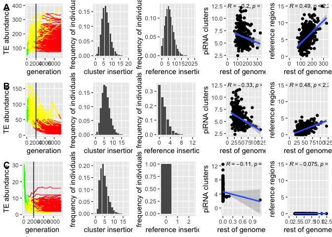

supp-negative\_strengths
================
Filip Wierzbicki
6/27/2022

``` bash
#cmds to run invade-simulation on vetlinux05
nohup sh -c 'python ../../scripts/simstorm-x0.01.py --number 300 --threads 20 --output x0.01- --invade ../../invade-v0808.jar --silent' &
nohup sh -c 'python ../../scripts/simstorm-x0.001.py --number 300 --threads 20 --output x0.001- --invade ../../invade-v0808.jar --silent' &
nohup sh -c 'python ../../scripts/simstorm-x0.0001.py --number 300 --threads 20 --output x0.0001- --invade ../../invade-v0808.jar --silent' &
#followed by concatenation of output-* and tally-* files to load into R
```

``` r
library(dplyr)
```

    ## 
    ## Attaching package: 'dplyr'

    ## The following objects are masked from 'package:stats':
    ## 
    ##     filter, lag

    ## The following objects are masked from 'package:base':
    ## 
    ##     intersect, setdiff, setequal, union

``` r
library(ggplot2)
library(ggpubr)
gentx=2000


####x0.01

tally<-read.table("/Users/filipwierzbicki/Desktop/trap_model/analysis/simulations/storm2/x0.01/combined/tally_x0.01.txt")


names(tally)<-c("replicate","generation","type","abundance","number")

t<-subset(tally,generation==gentx)
t<-subset(t,type=="cluster")


####
replicate<-c()

for(i in 1:nrow(t)) {
  row <- t[i,]
  if (row$abundance=="0"&row$number>10){
    replicate<-append(replicate,row$replicate)
  }
}

replicate<-as.data.frame(replicate)
t<-anti_join(t,replicate,by="replicate")

#####

for (sid in unique(t$abundance)) { 
  i <- t$abundance == sid
  a = sum(t$number[i])
  t$sum[i] = a
} 

ts<-unique(subset(t,select=c("abundance","sum")))
ts$rel<-ts$sum/sum(ts$sum)

histo<-ggplot(ts, aes(x=abundance, y=rel)) + geom_bar(stat = "identity")+ylab("frequency")+xlab("trap insertions")

t<-subset(tally,generation==gentx)
t<-subset(t,type=="ref")
t<-anti_join(t,replicate,by="replicate")#new filter
for (sid in unique(t$abundance)) { 
  i <- t$abundance == sid
  a = sum(t$number[i])
  t$sum[i] = a
} 

ts<-unique(subset(t,select=c("abundance","sum")))
ts$rel<-ts$sum/sum(ts$sum)

historef<-ggplot(ts, aes(x=abundance, y=rel)) + geom_bar(stat = "identity")+ylab("frequency")+xlab("reference insertions")


output<-read.table("/Users/filipwierzbicki/Desktop/trap_model/analysis/simulations/storm2/x0.01/combined/output_x0.01.txt")

output<-output[,-28]
names(output)<-c("replicate","generation","delim1",
            "fwt",  "w",    "tes",  "popfreq",  "fixed","delim2",
            "fwcli",    "cluins",   "cluins_popfreq","cluins_fixed",    "phase","delim3",
            "fwrefi",   "refins",   "refins_popfreq", "refins_fixed","delim4",
            "novel",    "sites",    "clusites", "tes_stdev" ,"cluins_stdev" ,"fw0", "w_min","popsize")


ts<-subset(output,generation==gentx)
ts<-anti_join(ts,replicate,by="replicate")#new filter
ts$tesc<-ts$tes-ts$cluins
ts$tesr<-ts$tes-ts$refins#-ts$cluins
cluster<-subset(ts,select = c("tesc","cluins"))
names(cluster)<-c("global","local")
cluster$type<-("cluster")
reference<-subset(ts,select = c("tesr","refins"))
names(reference)<-c("global","local")
reference$type<-c("reference")
cr<-rbind(cluster,reference)


correlationC<-ggplot(cluster, aes(x=global, y=local)) + geom_point()+stat_cor(method = "kendall", cor.coef.name="tau", label.x = 0.1, label.y = 12.5,size=3)+ 
  geom_smooth(method='lm', formula= y~x)+xlab("non-trap insertions")+ylab("trap insertions")
correlationR<-ggplot(reference, aes(x=global, y=local)) + geom_point()+stat_cor(method = "kendall", cor.coef.name="tau", label.x = 0.1, label.y = 0.05,size=3)+ 
  geom_smooth(method='lm', formula= y~x)+xlab("non-reference insertions")+ylab("reference insertions")

####trajectories:
output<-subset(output,select=c("replicate","generation","tes","phase"))#for new filter
output<-anti_join(output,replicate,by="replicate")#new filter
trajectories<-ggplot(output, aes(x = generation, y = tes, group = replicate,col= factor(phase))) +
  geom_line() +geom_vline(xintercept =  gentx,col="black")+scale_color_manual(values = c("green", "yellow", "red"))+theme(legend.position = "None")+ylab("TE abundance")+xlim(0,7500) 


g01<-ggarrange(trajectories,histo,historef, correlationC, correlationR,
             #labels = c("A","B","C","D","E"),
             ncol = 5, nrow = 1)
```

    ## Warning: Removed 4950 row(s) containing missing values (geom_path).

``` r
####x0.001

tally<-read.table("/Users/filipwierzbicki/Desktop/trap_model/analysis/simulations/storm2/x0.001/combined/tally_x0.001.txt")


names(tally)<-c("replicate","generation","type","abundance","number")

t<-subset(tally,generation==gentx)
t<-subset(t,type=="cluster")

for (sid in unique(t$abundance)) { 
  i <- t$abundance == sid
  a = sum(t$number[i])
  t$sum[i] = a
} 

ts<-unique(subset(t,select=c("abundance","sum")))
ts$rel<-ts$sum/sum(ts$sum)

histo<-ggplot(ts, aes(x=abundance, y=rel)) + geom_bar(stat = "identity")+ylab("frequency")+xlab("trap insertions")

t<-subset(tally,generation==gentx)
t<-subset(t,type=="ref")

for (sid in unique(t$abundance)) { 
  i <- t$abundance == sid
  a = sum(t$number[i])
  t$sum[i] = a
} 

ts<-unique(subset(t,select=c("abundance","sum")))
ts$rel<-ts$sum/sum(ts$sum)

historef<-ggplot(ts, aes(x=abundance, y=rel)) + geom_bar(stat = "identity")+ylab("frequency")+xlab("reference insertions")


output<-read.table("/Users/filipwierzbicki/Desktop/trap_model/analysis/simulations/storm2/x0.001/combined/output_x0.001.txt")

output<-output[,-28]
names(output)<-c("replicate","generation","delim1",
            "fwt",  "w",    "tes",  "popfreq",  "fixed","delim2",
            "fwcli",    "cluins",   "cluins_popfreq","cluins_fixed",    "phase","delim3",
            "fwrefi",   "refins",   "refins_popfreq", "refins_fixed","delim4",
            "novel",    "sites",    "clusites", "tes_stdev" ,"cluins_stdev" ,"fw0", "w_min","popsize")


ts<-subset(output,generation==gentx)

ts$tesc<-ts$tes-ts$cluins
ts$tesr<-ts$tes-ts$refins#-ts$cluins
cluster<-subset(ts,select = c("tesc","cluins"))
names(cluster)<-c("global","local")
cluster$type<-("cluster")
reference<-subset(ts,select = c("tesr","refins"))
names(reference)<-c("global","local")
reference$type<-c("reference")
cr<-rbind(cluster,reference)


correlationC<-ggplot(cluster, aes(x=global, y=local)) + geom_point()+stat_cor(method = "kendall", cor.coef.name="tau", label.x = 5, label.y = 12.5,size=3)+ 
  geom_smooth(method='lm', formula= y~x)+xlab("non-trap insertions")+ylab("trap insertions")
correlationR<-ggplot(reference, aes(x=global, y=local)) + geom_point()+stat_cor(method = "kendall", cor.coef.name="tau", label.x = 5, label.y = 6,size=3)+ 
  geom_smooth(method='lm', formula= y~x)+xlab("non-reference insertions")+ylab("reference insertions")

####trajectories:

trajectories<-ggplot(output, aes(x = generation, y = tes, group = replicate,col= factor(phase))) +
  geom_line() +geom_vline(xintercept =  gentx,col="black")+scale_color_manual(values = c("green", "yellow", "red"))+theme(legend.position = "None")+ylab("TE abundance")+xlim(0,7500) 


g001<-ggarrange(trajectories,histo,historef, correlationC, correlationR,
             #labels = c("A","B","C","D","E"),
             ncol = 5, nrow = 1)
```

    ## Warning: Removed 7500 row(s) containing missing values (geom_path).

``` r
####x0.0001

tally<-read.table("/Users/filipwierzbicki/Desktop/trap_model/analysis/simulations/storm2/x0.0001/combined/tally_x0.0001.txt")


names(tally)<-c("replicate","generation","type","abundance","number")

t<-subset(tally,generation==gentx)
t<-subset(t,type=="cluster")

for (sid in unique(t$abundance)) { 
  i <- t$abundance == sid
  a = sum(t$number[i])
  t$sum[i] = a
} 

ts<-unique(subset(t,select=c("abundance","sum")))
ts$rel<-ts$sum/sum(ts$sum)

histo<-ggplot(ts, aes(x=abundance, y=rel)) + geom_bar(stat = "identity")+ylab("frequency")+xlab("trap insertions")

t<-subset(tally,generation==gentx)
t<-subset(t,type=="ref")

for (sid in unique(t$abundance)) { 
  i <- t$abundance == sid
  a = sum(t$number[i])
  t$sum[i] = a
} 

ts<-unique(subset(t,select=c("abundance","sum")))
ts$rel<-ts$sum/sum(ts$sum)

historef<-ggplot(ts, aes(x=abundance, y=rel)) + geom_bar(stat = "identity")+ylab("frequency")+xlab("reference insertions")


output<-read.table("/Users/filipwierzbicki/Desktop/trap_model/analysis/simulations/storm2/x0.0001/combined/output_x0.0001.txt")

output<-output[,-28]
names(output)<-c("replicate","generation","delim1",
            "fwt",  "w",    "tes",  "popfreq",  "fixed","delim2",
            "fwcli",    "cluins",   "cluins_popfreq","cluins_fixed",    "phase","delim3",
            "fwrefi",   "refins",   "refins_popfreq", "refins_fixed","delim4",
            "novel",    "sites",    "clusites", "tes_stdev" ,"cluins_stdev" ,"fw0", "w_min","popsize")


ts<-subset(output,generation==gentx)

ts$tesc<-ts$tes-ts$cluins
ts$tesr<-ts$tes-ts$refins#-ts$cluins
cluster<-subset(ts,select = c("tesc","cluins"))
names(cluster)<-c("global","local")
cluster$type<-("cluster")
reference<-subset(ts,select = c("tesr","refins"))
names(reference)<-c("global","local")
reference$type<-c("reference")
cr<-rbind(cluster,reference)


correlationC<-ggplot(cluster, aes(x=global, y=local)) + geom_point()+stat_cor(method = "kendall", cor.coef.name="tau", label.x = 50, label.y = 12.5,size=3)+ 
  geom_smooth(method='lm', formula= y~x)+xlab("non-trap insertions")+ylab("trap insertions")
correlationR<-ggplot(reference, aes(x=global, y=local)) + geom_point()+stat_cor(method = "kendall", cor.coef.name="tau", label.x = 50, label.y = 15.0,size=3)+ 
  geom_smooth(method='lm', formula= y~x)+xlab("non-reference insertions")+ylab("reference insertions")

####trajectories:

trajectories<-ggplot(output, aes(x = generation, y = tes, group = replicate,col= factor(phase))) +
  geom_line() +geom_vline(xintercept =  gentx,col="black")+scale_color_manual(values = c("green", "yellow", "red"))+theme(legend.position = "None")+ylab("TE abundance")+xlim(0,7500) 


g0001<-ggarrange(trajectories,histo,historef, correlationC, correlationR,
             #labels = c("A","B","C","D","E"),
             ncol = 5, nrow = 1)
```

    ## Warning: Removed 7500 row(s) containing missing values (geom_path).

``` r
#############
#combine plots:

g<-ggarrange(g0001,g001,g01,
             labels = c("A","B","C"),
             ncol = 1, nrow = 3)

plot(g)
```

<!-- -->

``` r
ggsave("/Users/filipwierzbicki/Desktop/trap_model/figures/simulations/simulations_supp-negative-strength.pdf",height = 12,width = 12)
ggsave("/Users/filipwierzbicki/Desktop/trap_model/figures/simulations/simulations_supp-negative-strength.png",height = 12,width = 12)
```
